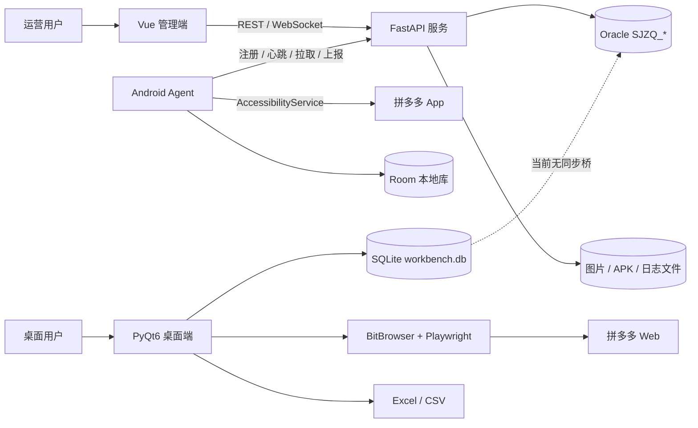
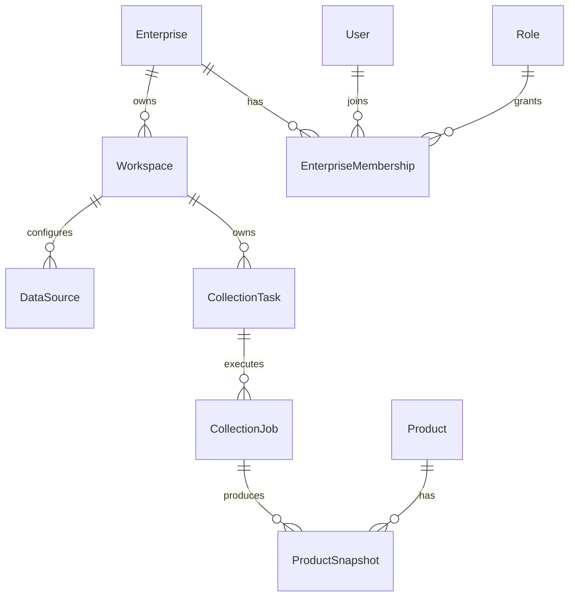
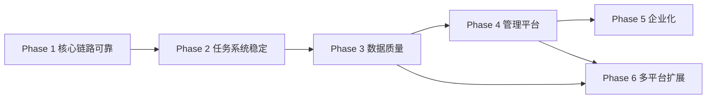

# 项目审计与 GAP 基线（更新于 2026-08-17）

## Phase 2 状态更新（2026-08-17）

| GAP | 状态 | 证据 |
|---|---|---|
| P0-04 Task 混入 Worker 执行状态、无 Job/Attempt | **CLOSED** | `SJZQ_COLLECTION_JOB/ATTEMPT`、正式状态机与 ADR；Job 稳定 identity，Attempt 独立保留历史 |
| P0-05 领取非原子、旧 Worker 可迟到覆盖 | **CLOSED** | Oracle `FOR UPDATE SKIP LOCKED`、active Attempt 唯一栅栏、Lease token hash；旧 Lease 在商品、图片、checkpoint、complete 前统一拒绝 |
| P0-06 App/Worker 崩溃后任务丢失或永久 running | **CLOSED** | Room assignment/outbox、recover API、heartbeat、Lease expiration、30 秒 reconciliation、WorkManager/前台服务/启动恢复 |
| P0-07 多商品/零结果/部分拒绝终态不可靠 | **CLOSED** | 完整 receipt manifest；零 ACK → `NO_CONFIRMED_RESULT`；任一 rejected → data quality failure；真实 Oracle 多商品 canonical receipt 测试 |
| P0-08 Checkpoint 只有版本没有恢复进度 | **CLOSED（首版槽位粒度）** | 只有已 ACK 商品进入 `confirmed_slots`；服务端返回 checkpoint；恢复后跳过 `keyword|pick_tag`；分页 cursor 留给分页 Collector |
| P1-06 用户 Pause/Resume 无权威语义 | **CLOSED** | Task pause 阻止分配；运行 Job checkpoint 后 yield；失联由 reclaim 转 paused；resume 恢复 pending |
| P1-07 无服务端一致性巡检 | **CLOSED** | 周期/按需 reconciliation 覆盖过期 Lease、无效 ownership、结果/状态不一致、重复 Attempt、设备孤儿指针与 outbox |
| P1-08 Android force-stop/厂商省电无法保证主动唤醒 | **KNOWN LIMITATION** | 不承诺无限常驻；降级为服务端 Lease 到期、其他设备或后续启动重试，不会永久占用 Job |
| P1-09 Task `DEADLINE_AT` 自动终结策略 | **OPEN** | 字段与超时分层已定义；当前 Job/Attempt timeout 由 Lease reclaim 落地，Task 总 deadline 的业务终态策略待产品确认 |
| P2-03 托管 CI 与真机破坏性场景 | **OPEN** | 本地统一门禁、Oracle/JVM 故障注入已覆盖；真实设备 kill/Doze/断网长稳与 CI 尚未自动化 |

Phase 2 的新增 P0 已全部关闭；总体完成度约 **65%**。系统已具备单租户内测所需的可恢复任务执行核心，但真机长稳、分页覆盖率、ProductSnapshot/数据质量工作台和企业隔离仍未进入完成态。

## Phase 1 状态更新（2026-08-16）

| 原 GAP | 当前状态 | 证据 |
|---|---|---|
| P0-01 上传失败仍可能完成 | **CLOSED** | Android Room outbox；商品/图片/finish 明确 ack；Oracle receipt + finish manifest；离线、JVM 与真实 Oracle 测试均通过 |
| P0-02 异常页/缺失数据可成功 | **CLOSED** | 10 类 fixture；Android `ProductQualityGate`；服务端 `product_quality.py`；异常页与缺价格均 quarantined |
| P0-03 完整运行基线未验证 | **CLOSED** | 统一严格入口实测 Python 60、Oracle 8、Android JVM 36、Web build 全部 PASS，exit=0 |
| P1-05 空值/0/推断混淆 | **PARTIAL** | Android 销量改为 nullable；field_sources/parser/rules version 已贯通；完整 Snapshot 数据契约留待后续小步实施 |
| P2-01 无 fixture 库 | **CLOSED** | `tests/fixtures/pinduoduo/` 具备 10 类离线样本 |
| P2-02 测试层次/CI 不完整 | **PARTIAL** | 已有统一本地入口、MockWebServer、Room migration/outbox 重启和真实 Oracle runner；CI 自动化尚未完成 |

Phase 1 的 P0 已全部关闭。专用 Oracle 测试 Schema 已完成迁移及 8 项真实事务验收，测试标记数据清理后残留为 0。

> 范围：桌面采集器、`server/`、`web/`、`android_collector/`、数据库、配置、日志、测试与文档。
> 初始审计仅调查、验证和更新文档；其后的 Phase 1 增加了小步、向前兼容的可靠性和质量门禁实现，未执行 Product/Snapshot 大规模迁移。当前代码与实测优先于旧文档。

## 1. 结论与完成度

系统有两条独立采集链：

1. **平台链**：Vue → FastAPI/Oracle → Android Agent → 拼多多 App → Oracle → Vue。
2. **旧桌面链**：PyQt6 → BitBrowser/Playwright → 拼多多 Web → SQLite/Excel。

平台链已有任务创建、审核、领取、搜索/排序、详情解析、商品/图片上报、状态机、异常记录和结果展示。Phase 1 已补齐异常页/质量门禁、Android 持久 outbox、商品/图片/finish 幂等 receipt 和完成 manifest，页面操作或 HTTP 200 不再等价于成功。执行租约、无人值守后台唤醒、ProductSnapshot 和企业隔离仍属于后续阶段。

| 能力域 | 完成度 | 判断 |
|---|---:|---|
| 单租户管理骨架 | 70% | 用户/RBAC、任务、设备、商品、报表页面已存在 |
| 拼多多 Android 采集 | 75% | 最小可靠闭环及离线/JVM 回归完成；真机长稳和后台调度待 Phase 2 |
| 旧桌面采集 | 65% | 搜索/详情/SQLite/Excel 较完整，但与平台链断开 |
| 任务状态一致性 | 75% | 权威状态机、receipt/outbox/finish 门禁及真实事务测试完成；缺 lease/checkpoint/reclaim |
| 搜索完整性 | 45% | 支持关键词/排序/滚动/前 N；无分页终止和覆盖率 |
| 商品详情字段 | 60% | 多源解析较丰富；缺来源、置信度、必填和异常页门禁 |
| 数据质量与去重 | 45% | 基础质量状态、任务内商品去重和异常隔离完成；ProductSnapshot 尚未实施 |
| 自动化测试 | 70% | Python 60、Oracle 8、Android JVM 36、Web build 纳入统一严格入口；CI 待建设 |
| 企业化 | 15% | 只有全局 RBAC/owner，无租户/workspace 隔离 |
| 多平台扩展 | 20% | 服务端有平台码，动作/解析仍高度耦合拼多多 |

**总体约 50%**：适合作为单租户内测骨架，尚不能宣称稳定生产采集或多企业交付。

## 2. 当前系统架构图



证据：`server/main.py:22-56`、`server/routers/tasks.py:44-934`、`server/routers/products.py:31-482`、`AgentCoordinator.kt:30-327`、`TaskEngine.kt:139-760`、`task_runner.py:81-559`、`storage_exporter.py:16-400`。

## 3. 完整采集流程

| 步骤 | 当前实现/文件 | 审计结论 |
|---|---|---|
| 用户创建任务 | `TaskCreate.vue:220-264` → `POST /api/tasks` | 已实现 |
| 任务持久化 | `tasks.py:44-107` 写 `SJZQ_TASK/TASK_ITEM` | 已实现，默认待审核 |
| 任务调度 | `tasks.py:590-741`；Agent 主动 pull，服务端锁设备 | 无独立 scheduler、lease、超时回收 |
| 页面/请求执行 | Android `PddActions.kt`；桌面 `browser_client.py` | 两套链不共享采集协议 |
| 搜索结果获取 | `TaskEngine.kt:189-306`；`search_sort.py:20-310` | 支持排序/前 N；无分页 checkpoint/覆盖率 |
| 商品 ID 获取 | `A11yHelper.kt:821`、`GoodsLinkResolver.kt`、`list_parser.py` | 多源获取；无全局唯一性/来源记录 |
| 商品详情获取 | `TaskEngine.kt:435-760`、`DetailReader.kt`、`detail_parser.py` | 字段丰富，启发式较多 |
| 解析/标准化 | `DetailReader.kt`、`list_parser.py:227-274`、`detail_parser.py` | 缺跨端统一契约和 parser version |
| 去重 | `list_parser.py:365-378` 仅单次列表 ID 去重 | Android/Oracle/SQLite 无商品业务幂等 |
| 数据库存储 | Room DAO → `ApiClient.kt:148-201` → `products.py:31-215` | 无 outbox；Product 与 Snapshot 混合 |
| 结果展示 | `TaskDetail.vue:172-199` 轮询任务/商品，WS 显示日志 | 无质量状态和失败工作台 |
| 异常处理 | `AccessGuard.kt`、`TaskEngine.kt:362-432`、`tasks.py:466-504` | 错误分类/恢复不统一 |
| 任务结束 | `AgentCoordinator.kt:105-117` → `tasks.py:832-934` | finish 丢失无恢复；可能假完成 |

## 4. 搜索与详情审计

### 搜索已有能力

- 关键词搜索与输入确认：`PddActions.kt:49-102`、`list_parser.py:223-224`。
- 综合、价格升序、销量降序：`TaskEngine.kt:244-306`、`search_sort.py:236-310`。
- Android 固定滚动后取前 N；桌面按配置滚动。
- DOM/无障碍节点、网络响应、分享链、URL 多路取商品 ID。
- 桌面单次列表按 `item_id` 去重。

### 搜索缺口

- 无页码/游标、连续无新增终止和已见 ID checkpoint。
- `scrollList(2)` + `openIndex` 不能证明覆盖请求的前 N 或完整结果。
- 无 `raw_count/new_count/duplicate_count/scroll_round/stop_reason`。
- 排序降级没有 `sort_verified=false` 或低置信度标记。
- 综合/价格/销量、多个关键词或重试会重复入库。

### 详情字段来源

| 字段 | Android 来源 | 桌面来源 | 风险 |
|---|---|---|---|
| 名称 | 参数标签/页面文本，缺失时组合售卖名 | `goods_name`、属性、`og:title`、标题 | 错误页可被兜底 |
| 商品 ID | 列表 hint、分享链、页面/URL、网络 | 列表网络/DOM、详情 `goods_id` | 服务端允许空，无唯一约束 |
| 链接 | 分享链或按 ID 构造 | 详情 URL 或按 ID 构造 | 未统一校验最终商品页 |
| 当前价 | 列表卡片 | 列表价格字段，分/元归一化 | 不一定是成交价 |
| 展示/拼单/成交价 | 底部购买栏、SKU 面板 | DOM/网络/正文候选 | 语义/来源未持久化 |
| 原价 | “即将恢复/原价/划线价” | `normal/market/origin/old_price` | 可能与单买价混淆 |
| SKU/价格 | 面板文本、逐项点击、区间推断 | SKU JSON、DOM、点击、区间推断 | 推断值未与实测区分 |
| 销量 | “总售/近30天已拼/已拼” | 文案与 `sales_tip` | 未解析与真实 0 混淆 |
| 店铺 | 店铺区文本 | JSON、DOM/后缀正则 | 易受文案变化影响 |
| 图片 | 图片探测、相册、分享/网络 URL | gallery/DOM/`og:image`/列表图 | 文件失败无持久重试 |
| 属性 | 商品参数面板 | 属性对象与标签正则 | 无字段来源/置信度 |

## 5. 稳定性矩阵

| 能力 | 状态 | 结论 |
|---|---|---|
| 请求频率控制 | 部分 | 有随机等待/批次冷却；无统一限速和账号预算 |
| 并发控制 | 部分 | Oracle 领取有行锁；桌面并发配置未形成统一控制 |
| 暂停/恢复 | 缺失 | 桌面仅进程内 Event；Web/Android 无权威暂停/恢复 |
| 超时 | 部分 | HTTP/页面有局部超时；任务无总时限/lease |
| 重试 | 部分 | 繁忙有有限重试；上传/finish 无持久重试 |
| 失败记录 | 部分 | 有日志/异常；失败分类和证据不统一 |
| Checkpoint | 缺失 | Excel 行任务有；普通关键词/Android 无 |
| 缓存 | 缺失 | 当前无证据表明应优先引入缓存 |
| 数据去重 | 缺失 | Oracle/Room/桌面商品表无业务幂等键 |
| Session 生命周期 | 部分 | 可开关环境；登录有效性/轮换/过期不足 |
| 浏览器生命周期 | 部分 | 有 finally 清理；崩溃残留未自动化验证 |
| 异常/登录页识别 | 部分 | 搜索与 Android 局部具备；桌面详情不足 |
| 网络失败 | 部分 | 有超时日志；无 outbox/backoff/dead-letter |
| 数据缺失检测 | 缺失 | 服务端字段几乎全 Optional，无质量门禁 |
| 任务超时回收 | 缺失 | 设备掉线后 running 可能长期占用 |

## 6. 数据质量基线设计

本轮只定义，不迁移。每个结果在正式快照前应产生：

```text
parse_status: success | partial | failed
page_status: product | sold_out | not_found | login_required | challenge | network_error | unknown
quality_status: passed | warning | quarantined
missing_fields, quality_rules_version, parser_version
field_sources: {field: source_type}
```

| 检查项 | 建议定义 | 初始处理 |
|---|---|---|
| 必填完整率 | 非空必填数/必填总数 | item_id、name、item_url 必须有；至少一项有效价格，否则隔离 |
| 商品 ID 唯一性 | `(platform_code,item_id)` 主档唯一 | 重复采集写快照，不重复建主档 |
| SKU 完整率 | 有多规格证据时，已解析/可见规格 | 缺失标 warning/quarantine |
| 价格异常 | 空、`<=0`、极端跨度、原价低于现价、SKU 越界 | 规则版本化，保留原值/来源 |
| 销量为空 | NULL 与 0 分离 | 未解析写 NULL + reason |
| 数据重复 | 同 job/request 业务键重复率 | 幂等返回既有结果或拒绝 |
| 多次采集差异 | 相邻 snapshot 字段 diff | 输出价格/销量/availability 变化 |
| 下架/不存在 | 页面分类结果 | 写 availability 事件，不写伪成功 |
| 解析失败 | exception/必填不足 | 保留 evidence，进入 quarantine |

质量通过必须同时满足：页面为商品页、业务键合法、质量规则通过、存储提交成功。HTTP 200 只表示传输成功。

## 7. 企业化与多平台建议

当前是全局 `User → Role` 加 `OWNER_USER_ID`；任务、设备、商品、报表缺一致租户过滤，只适合单租户。



- `Enterprise`：客户主体、状态、配额、保留策略。
- `User`：全局身份，通过 membership 多企业加入。
- `Role`：平台角色与企业/workspace 角色分域。
- `Workspace/Project`：企业内任务、数据源、结果边界。
- `CollectionTask`：用户意图；`CollectionJob`：一次 attempt，含 lease/checkpoint/设备。
- `DataSource`：平台、账号/会话引用、能力；密钥单独管理。
- `Product`：平台商品主档；`ProductSnapshot`：某次 job 的不可变采集事实。

| 表域 | `enterprise_id` | `workspace_id` |
|---|---|---|
| Workspace | 必须 | 自身主键 |
| membership/角色授权 | 必须 | workspace 授权时必须 |
| Device/PlatformAccount/DataSource | 必须 | 建议必须或用绑定表 |
| Task/Job/TaskItem | 必须 | 必须 |
| Snapshot/图片/原始证据/quarantine | 必须 | 必须 |
| 日志/异常/告警/导出/报表 | 必须 | 必须 |
| Product 主档 | 取决于共享策略 | 取决于共享策略 |
| 平台字典 | 不需要 | 不需要 |

推荐“公共商品标识 + 企业隔离快照/业务数据”，但商品主档是否共享必须业务确认。本轮不迁移。

平台码已存在，但 `PddActions`、`DetailReader`、`goods_id`、`yangkeduo.com`、“已拼”高度耦合。拼多多稳定后只包裹最小接口：

```text
Collector
├─ SearchCollector.search(keyword, options) -> SearchPage
├─ DetailCollector.collect(ProductRef) -> RawDetail
├─ Parser.parse(raw) -> ParsedProduct
├─ Normalizer.normalize(parsed) -> ProductSnapshotDraft
└─ Storage.store(snapshot, idempotency_key) -> StoreResult
```

不先建动态插件系统；Parser 应纯函数化并用固定样本测试。

## 8. 测试审计

| 命令 | 字面结果 | 退出码 |
|---|---|---:|
| `.\.venv-t001\Scripts\python.exe -m unittest discover -s tests -v` | `Ran 44 tests ... OK (skipped=4)`；40 通过，4 个 Oracle 测试因未配置隔离 schema 跳过 | 0 |
| 默认 Node 20：`npm run build` | `SyntaxError ... node:util ... styleText` | 1 |
| Node 22.18：`npm run build` | `1665 modules transformed`；`built in 7.96s`；有 >500 kB warning | 0 |
| `gradlew.bat testDebugUnitTest --no-daemon` | `JAVA_HOME is not set and no 'java' command could be found in your PATH.` | 1 |

现有 Python 测试覆盖配置、密钥、状态机、mock 事务、进度幂等和竞态路径。Android 源码有 18 个 JVM 单测但本机未执行。无 Web 自动测试、CI 和独立 fixtures。缺 Parser 样本、真实 FastAPI/Oracle 集成、Agent E2E、断网/重启/重复请求/恢复、Room migration、质量、容量和耐久测试。

## 9. 最新 GAP

同一文件同一时间只允许一个 Agent 修改；“可并行”仅指依赖满足后可分文件推进。

### P0：核心不可用或错误判成功

| 问题 | 涉及模块 | 影响 | 建议方案 | 复杂度 | 推荐 Agent | 可并行 | 验收方式 |
|---|---|---|---|---|---|---|---|
| P0-01 上传失败仍可能完成 | `AgentCoordinator.kt:48-60,105-117`、`ApiClient.kt`、finish 链 | 商品/图片/finish 失败仅记日志，任务可 complete | 定义成功不变量；持久化 outbox、幂等键；全部确认后才完成 | 高 | Sol：Android+协议 | 否 | 断网/5xx/App 重启不丢；未确认商品不计成功；重复 10 次只写一次 |
| P0-02 异常页/缺失数据可成功 | `detail_parser.py:1011-1153`、`task_runner.py:163-169`、`DetailReader.kt`、schema | 登录/验证/下架/解析失败可形成伪商品 | 页面分类器+质量门禁；失败入 quarantine | 中 | Sol：Parser/Quality | 与 P0-01 可分文件并行 | 固定异常样本全分类；伪商品 0；缺失原因可查询 |
| P0-03 完整运行基线未验证 | Oracle、Android、工具链 | 初始阶段缺少真实事务与 Android parser 通过证据 | 隔离 Oracle、JDK17、统一 test entry，再接 CI | 中 | Luna 调查+Terra 工具链 | 是 | **CLOSED：Oracle 8/8、Android 36/36、统一严格命令 exit 0** |

### P1：稳定性或正确性

| 问题 | 涉及模块 | 影响 | 建议方案 | 复杂度 | 推荐 Agent | 可并行 | 验收方式 |
|---|---|---|---|---|---|---|---|
| P1-01 无主档/快照/业务去重 | 三类商品表、`products.py` | 重试/多关键词重复，比价失真 | **CLOSED Phase 3**：`PRODUCT_MASTER + PRODUCT_SNAPSHOT`；数据库唯一键 `(platform,item_id)` | 高 | Sol：数据模型 | 否，依赖字段契约 | Oracle 已验证主档唯一、快照追加、receipt replay 与 diff |
| P1-02 无 job/attempt/lease/checkpoint | task/状态机/Agent | 掉线后卡住或整单重跑 | Job、续租、回收、item checkpoint | 高 | Sol：状态机 | 与质量可并行 | 断电/断网/重启后恢复且不重复计数 |
| P1-03 无远程暂停/恢复 | Web/API/Android | 运营无法安全控制长任务 | 权威 pause request/ack/resume，安全点确认 | 中 | Sol：任务系统 | 依赖 P1-02 | 暂停不启动新 item；重启保留；恢复续跑 |
| P1-04 搜索完整性不可度量 | `PddActions`、`TaskEngine`、`list_parser` | 漏采/重复无指标 | 已见集合、无新增终止、滚动统计、排序验证 | 中 | Luna 样本+Terra 实现 | 是 | 长列表 fixture 得到预期唯一 ID 和 stop_reason |
| P1-05 空值/0/推断混淆 | Parser/schema/商品表 | 销量/价格/SKU 错误且不可追溯 | **CLOSED Phase 3**：NULL、field source、parser/rules version 写入 Snapshot/QualityResult | 中 | Sol：契约 | 是 | 固定 fixture 验证销量/SKU 缺失为 NULL+warning，价格缺失隔离 |
| P1-06 无质量门禁/quarantine | 商品上报、异常、Web | 坏数据直入库，无复核入口 | **PARTIAL CLOSED**：统一 QualityGate 与持久 Quarantine 已完成；处置 UI 留 Phase 4 | 高 | Sol 后端+Terra Web | 依赖 P1-05 | fixture/Oracle 验证无正常 Snapshot 污染；Phase 4 增加查看/处置 UI |
| P1-07 页面/Session 生命周期不足 | BitBrowser、Parser、AccessGuard | 登录失效/挑战恢复不一致 | 统一 page/error/retryable 分类和 session 策略 | 中 | Sol：运行时 | 是 | 登录过期/验证码/繁忙/下架得到确定状态/有限重试 |
| P1-08 两条链无权威定位 | 桌面 SQLite 与 Android/Oracle | 口径分裂、双维护 | 确认保留/冻结/平台化；若保留走同一 Agent API | 中 | Luna+Tech Lead | 可先调查 | ADR 明确单一权威任务/数据口径和回滚边界 |
| P1-09 休息逻辑硬关闭 | `tasks.py:40-41`、devices | 配置与行为不一致 | 补测试后启用，或删除无效承诺 | 低 | Terra：后端 | 是 | 配置产生确定行为，UI/API 一致 |

### P2：工程能力缺失

| 问题 | 涉及模块 | 影响 | 建议方案 | 复杂度 | 推荐 Agent | 可并行 | 验收方式 |
|---|---|---|---|---|---|---|---|
| P2-01 无 fixture 库 | Python/Android Parser | 改版回归不可复现 | **CLOSED Phase 1/3**：PDD 页面 fixtures + Phase 3 质量矩阵 | 中 | Luna：样本 | 是 | 全离线覆盖正常、页面异常、字段缺失/异常、来源与版本 |
| P2-02 测试层次/CI 不完整 | Python/Web/Android/Oracle | 回归依赖特定电脑 | fast/integration/device 分层；固定工具链 CI | 中 | Terra：DevEx | 是 | 干净 runner 自动测试并留报告/制品 |
| P2-03 日志/指标/错误码不统一 | 全链路 | 无法还原 task 时间线 | 贯通 request/task/item/job/attempt/device，结构化 stage/error | 中 | Sol：可观测性 | 依赖 P1-02 | 任一 task_id 可重建时间线并聚合错误/质量 |
| P2-04 Schema 迁移无版本/回滚 | init/migrate | 环境漂移、升级难审计 | **PARTIAL CLOSED**：Phase 3 建立版本表与 `P3_001` 可重入迁移；历史 patch 仍待版本化 | 高 | Sol：数据库 | 是 | P3 空库契约/旧库升级/重复迁移通过；历史 migration 收敛留技术债 |
| P2-05 Router/SQL/事务耦合 | FastAPI routers | 单测困难 | 按任务/商品逐域下沉 service/repository | 中 | Sol：后端 | 依赖测试 | Router 只做协议；事务可单测；契约不变 |
| P2-06 API 契约/校验不足 | Pydantic/Web/Android | Optional/`ok:false` 语义不一 | 版本化 OpenAPI、统一错误/分页/枚举/范围 | 中 | Terra：API/Web | 是 | 契约变化触发消费方失败；非法输入明确拒绝 |

### P3：优化与长期演进

| 问题 | 涉及模块 | 影响 | 建议方案 | 复杂度 | 推荐 Agent | 可并行 | 验收方式 |
|---|---|---|---|---|---|---|---|
| P3-01 缺企业/workspace | 用户/任务/设备/商品/报表 | 不能多企业隔离 | Phase 5 实施逻辑租户；先评审模型/访问矩阵 | 高 | Sol：架构/DB | 后期 | 两企业/同 ID 越权测试全过 |
| P3-02 平台代码耦合 PDD | Android/Desktop | 新平台复制大模块 | 拼多多稳定后包最小 adapter | 高 | Sol：架构 | 依赖 Phase1-3 | PDD 行为无差异；新平台不改 PDD parser |
| P3-03 查询/bundle 性能 | Product/report/Web | 规模后变慢 | 先指标，再 DB 分页/索引/聚合/分包 | 中 | Terra：性能 | 是 | 有 P95、计划、bundle 前后对比 |
| P3-04 缓存/多实例实时状态 | API/WS/投屏 | 扩容时不一致 | 指标驱动缓存；权威状态不缓存；评估 broker/sticky | 中 | Sol：分布式 | 后期 | 实例重启/切换可预测；无缓存仍正确 |

## 10. Roadmap 与依赖



1. **Phase 1 核心链路可靠**：固定 Oracle/Android/Node/Python 基线；补合法搜索/详情/异常 fixture；修复假完成与伪商品；定义成功不变量和幂等键。出口：创建→有效入库→完成可复现，失败不假成功。
2. **Phase 2 任务系统稳定**：Job/attempt/lease/续租/回收、checkpoint、暂停/恢复、outbox/dead-letter、全链路幂等。依赖 Phase 1。出口：断网和各类重启后状态/数据一致。
3. **Phase 3 数据质量**：评审并小步实施 Product/Snapshot；Parser/Normalizer/QualityGate；NULL/来源/置信度/版本；质量指标、差异和 quarantine。依赖 Phase 2 的 job/attempt。
4. **Phase 4 管理平台**：失败/质量工作台、任务控制、结构化日志、指标告警、真实分页、API/Web 测试。依赖 Phase 2 状态事件和 Phase 3 质量事件。
5. **Phase 5 企业化**：Enterprise/membership/Role scope/Workspace/配额/租户审计。依赖稳定的任务与商品模型，并先确认数据共享策略。
6. **Phase 6 其他平台**：基于稳定 PDD 建 adapter，逐个接京东/淘宝/1688；每个平台带 fixture、映射、质量规则、E2E。至少依赖 Phase 1-3。

## 11. 下一阶段最应该做的 5 项

1. **T004 固定样本与成功门禁**：正常详情、登录、验证码、繁忙、下架、不存在、价格/SKU 边界；先测试后改 parser。
2. **T005 Android 上报可靠性与假完成**：幂等键、outbox，商品/图片/finish 全确认才完成。
3. **T006 完整测试基线**：**DONE**；隔离 Oracle 8 项、JDK17 Android 36 项及统一严格入口均通过。
4. **T007 最小 Job/Lease/Checkpoint**：先 ADR/竞态矩阵，再超时回收、暂停/恢复、断线演练。
5. **T008 Product/Snapshot 与租户共享策略**：只做字段字典、唯一键、兼容/迁移方案和样本验证；未经确认不迁移。

T004/T005 先确定成功语义；T006 可并行；T007/T008 在成功语义固定后可由不同 Agent 并行，但数据库迁移只能由一个 Agent 执行。

## 12. 停止点

本轮已完成审计、验证和文档基线；未进行大规模重构或数据库迁移。等待 Roadmap 确认。
# Phase 4 收敛记录（2026-08-17）

- P1-06：Quarantine 后端事实与管理查看/筛选/定位闭环已完成；复杂人工修复流程保留。
- P2-03：Task/Job/Attempt/Device/trace/error 与质量业务结果已通过既有结构化 Job Event 和管理查询贯通。
- P3-03：后台核心增长列表已改为 Oracle 服务端分页；JSON 过滤与高基数索引继续由真实容量/执行计划驱动。
- 新增管理能力未进入 Enterprise/Workspace、其他平台 Collector、完整告警中心或 BI。

# Phase 5 收敛记录（2026-08-17）

- P3-01 Enterprise/Workspace：**CLOSED**。Enterprise、Workspace、membership、租户角色和 TenantContext 已建立。
- Product 共享策略：**CLOSED**。只共享内部平台 identity；EnterpriseProduct 与全部采集事实私有。
- 核心隔离：**CLOSED**。Task/Job/Attempt、Product/Snapshot/Quarantine、管理分页/指标与 Dashboard 使用服务端租户边界，真实 Oracle 两企业 ID 测试通过。
- Oracle migration：**CLOSED**。`P5_001/P5_002/P5_003` 已实际执行并重复执行成功。
- 配额：**FOUNDATION**。配额模型及 Workspace 创建门禁已落地；Active Task、Daily Snapshot、Storage 的写入时强制门禁和计量任务列为技术债务。
- 设备首次 enrollment：**P1 TECH DEBT**。新设备要求显式企业/Workspace 上下文；一次性 enrollment token、轮换和撤销仍需补齐。
- 非核心旧域：账号养护、OTA、投屏媒体 URL 和旧 Excel 兼容导出仍需继续收敛到统一 TenantContext；租户核心 API 与验收路径已封闭。

# Phase 5.5 企业化硬化收敛记录（2026-08-17）

- Device enrollment：**CLOSED IN CODE**。短期一次性 token 只存 hash，消费行锁、轮换、设备 key 轮换、revoke 及活动执行权终止已实现。
- 被撤销设备：**CLOSED IN CODE**。Heartbeat、Task/Job、商品/图片、OTA ack、投屏发布共用 active-device 查询门禁。
- 旁路 TenantContext：**CLOSED IN CODE**。账号养护、设备管理、租户 OTA 文件/指令、投屏 viewer、签名媒体、Excel 匹配/导出/建任务均带 Enterprise/Workspace 谓词；裸 `/media` 已关闭。
- 配额：**CLOSED IN CODE**。Active Task、Daily Snapshot、Storage 使用 Oracle usage/reservation/ledger，同事务 reserve/commit/release，usage 行锁封闭并发超卖，`P5_5_001` 回填存量事实。
- legacy/default：**EXIT CRITERIA DEFINED**。30 天零默认写入、全客户端显式上下文、存量归属清零、关闭 fallback 后真实 Oracle 全量通过等条件全部满足后，才执行独立移除迁移。
- 测试：Phase 5.5 离线专项 5/5 通过；全量 Python/Android/Web 结果记录于验收制品。隔离 Oracle 配置仍是无条件进入 Phase 6 的门禁。
- Phase 6：**不得无条件启动**。须先完成隔离 Oracle 上 `P5_5_001` 可重入迁移、真实两租户/撤销设备/配额并发/媒体旁路集成回归并全部通过。
