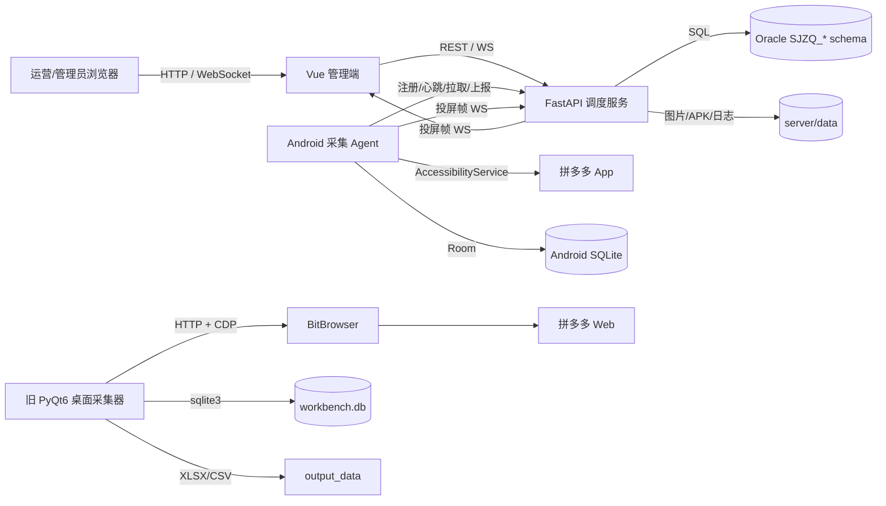
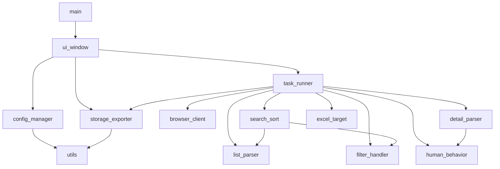
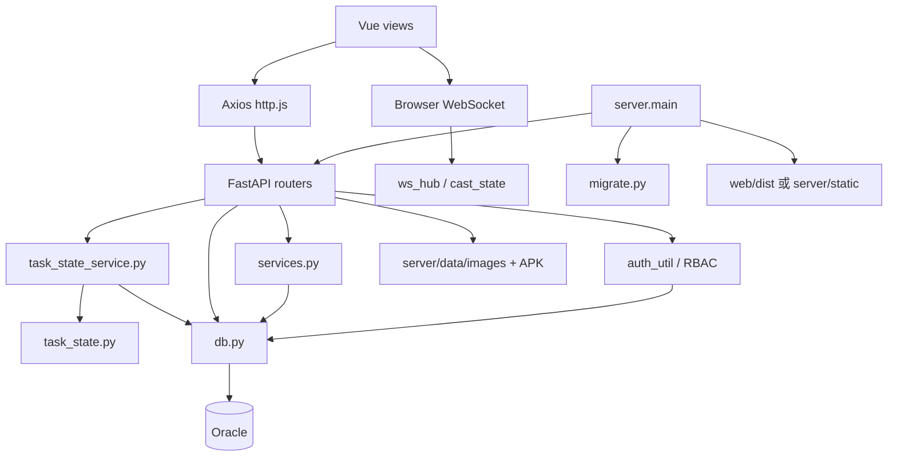
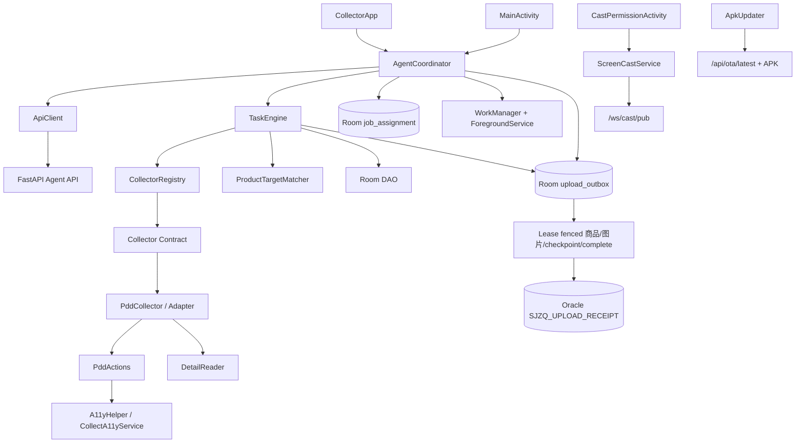
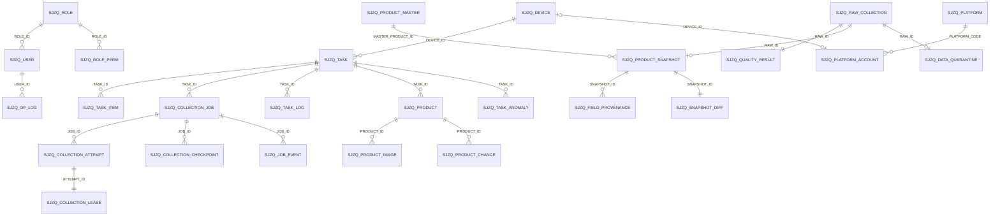
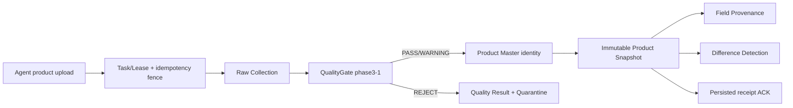

# 当前架构

> 本文描述当前代码实际呈现的架构，不代表目标架构。无法由代码和现有日志确认的部署信息标为 **UNKNOWN**。

## 1. 系统上下文

部署拓扑、反向代理、TLS、Oracle 所在网络、并发设备规模为 **UNKNOWN**。开发配置显示 Web 5173 代理到 FastAPI 8080；生产模式可由 FastAPI 托管 `web/dist`。

## 2. 组件依赖

### 2.1 旧桌面端

关键边界：

- UI 直接持有 `TaskRunner` 和 `StorageExporter`，没有应用服务/接口抽象。
- `TaskRunner` 同时负责线程状态、浏览器生命周期、采集策略、匹配、错误恢复和持久化编排。
- 解析模块直接依赖 Playwright 页面对象的动态行为，缺少稳定的页面快照契约。

### 2.2 服务端与 Web

路由按业务域拆分，但路由函数普遍直接书写 SQL、事务逻辑和响应转换；任务与任务项的业务状态例外，由 `task_state.py` 集中定义枚举/迁移/映射，并由 `task_state_service.py` 统一执行 Oracle 条件更新。设备连接/运行态仍由设备域维护。Web 页面也普遍直接调用 URL，前后端契约没有生成式客户端或共享 schema。

### 2.3 Android Agent

`AgentCoordinator` 是远程调度适配层；`TaskEngine` 是平台无关的本地执行状态机。它按任务的 `platform_code` 从 `CollectorRegistry` 获取 Collector，只消费统一 Search/Detail 结果和系统错误。`PddCollector` 包裹既有 `PddActions`、`DetailReader`、链接解析和页面错误映射；Registry 当前只注册拼多多。平台常量占位不代表 Collector 已接入。

## 3. 主要数据流

### 3.1 服务端调度采集

1. 管理员在 Vue 创建任务，页面调用 `POST /api/tasks`。
2. FastAPI 校验权限，将任务/任务项写入 `SJZQ_TASK`、`SJZQ_TASK_ITEM`；需审核的状态由代码规则决定。
3. 同一事务为采集 TaskItem 生成稳定 `CollectionJob.JOB_KEY`；Android 注册后调用 `POST /api/jobs/acquire`。
4. 服务端以 `FOR UPDATE SKIP LOCKED` 原子领取，创建 `CollectionAttempt` 与可过期 `Lease`；数据库只保存 token hash，bearer token 仅返回 Worker。
5. Agent 先把 Job/Attempt/Lease 写入 Room，再调用 start 并启动 `TaskEngine`；heartbeat 只用服务端时钟续租。
6. `TaskEngine` 经 Registry 调用平台 Collector；PDD Adapter 复用既有页面分类、详情解析与客户端质量行为并返回统一结果。异常页和必填字段失败不生成商品；通过门禁的商品与 `product` outbox 事件在同一 Room 事务写入。
7. `AgentCoordinator` 按持久 outbox 重试；`ApiClient` 使用稳定 idempotency key 上传商品，必要时上传本地图片，只有明确的 `acknowledged + persisted` 才将事件标记为 acked。
8. 服务端在同一 Oracle 事务写商品、任务计数与 `SJZQ_UPLOAD_RECEIPT`；同 key 同 payload 返回既有确认，同 key 不同 payload 拒绝。
9. 每个商品得到 ACK 后，Android 把 `keyword|pick_tag` 确认槽位写入单调、幂等 checkpoint；恢复时跳过已确认槽位。本地执行结束提交全部已确认 product receipt manifest，服务端逐项验证 lease、receipt、Product，并以 TaskItem 绑定商品作为 canonical result 后结束 Attempt/Lease。零确认结果和任一永久拒绝均转 Job failure，不能完成。
10. 只有全部 Job 到达确定终态，且每个 success Job 都能关联已确认 receipt/Product 时，服务端才聚合 Task 终态。旧 `/tasks/progress|finish` 对带 Job 的 Task 返回 lease/aggregation 错误。
11. 进程/App/网络恢复由 Room assignment/outbox、WorkManager、前台服务与 `/api/jobs/recover` 对齐；Lease 到期由 30 秒 reconciliation 自动 reclaim，旧 Worker 恢复后不能写入。

### 3.2 Excel 匹配

1. Web 上传 Excel 到 `/api/excel/match`。
2. 服务端用 openpyxl/xlrd 读取标题和行，规范化名称、规格、批准文号、厂家。
3. 服务端查询商品库并构造候选/匹配结果。
4. Web 展示结果，可导出回填后的工作簿，或把未匹配行转换为采集任务。
5. 导出时可从本地媒体目录或 URL 获取图片并写入工作簿。

### 3.3 商品生命周期

采集上传 → `SJZQ_PRODUCT`/`SJZQ_PRODUCT_IMAGE` → 管理端查询/编辑 → `SJZQ_PRODUCT_CHANGE` 记录变更 → 批量标记正式入库或软删除 → `T_GOODS_LIBRARY` 兼容视图供外部/后续流程读取。正式 `T_GOODS_LIBRARY` 表存在时的写入与同步责任为 **UNKNOWN**。

### 3.4 投屏

管理端请求 `/api/cast/{device_id}/start` → 服务端向设备控制通道发送开始指令 → Android 获取 MediaProjection 权限并连接 `/ws/cast/pub/{device_key}` → 服务端内存态 `cast_state` 转发帧 → 浏览器通过 `/ws/cast/view/{device_id}` 查看。服务重启会丢失内存会话状态。

### 3.5 旧桌面采集

UI 配置/关键词或 Excel → `TaskRunner` 工作线程 → BitBrowser API 创建/接管环境 → 搜索列表/排序 → 详情解析 → 过滤/目标匹配 → SQLite → Excel/CSV。该链路与 Oracle/Android 调度链路没有代码级共享数据库或同步过程。

## 4. 状态与持久化边界

| 状态 | 持久化位置 | 说明 |
|---|---|---|
| 用户/角色/权限/操作日志 | Oracle | 服务端唯一来源 |
| 任务/任务项 | Oracle | `task_state_service.py` 是业务状态修改入口；客户端状态只作协议映射 |
| Job/Attempt/Lease/Checkpoint | Oracle | `job_service.py` 是执行权入口；Lease token hash、Attempt 历史、确认 checkpoint 和 Job 结果 receipt 均持久化 |
| 设备/任务日志 | Oracle | 设备连接态/运行态与任务业务状态分离 |
| 商品/图片元数据/变更 | Oracle | 图片二进制在文件系统；远程 URL 图片允许 `REL_PATH=NULL`，本地上传必须保存相对路径 |
| APK 元数据/文件 | JSON + 文件系统 | `server/data/images/apk` |
| WS 连接/投屏房间 | 服务进程内存 | 重启不持久化 |
| Android 当前采集结果 | Room | 本地任务、商品、持久 upload outbox；in-flight 在重启后重置为 retry |
| Android 执行 assignment | Room | 保存 job/attempt/token/worker/checkpoint；仅用于恢复，服务端 active Lease 是真相 |
| Agent 上传确认 | Oracle | `SJZQ_UPLOAD_RECEIPT` 保存 product/image/finish 的 payload hash、结果与确认状态 |
| 商品稳定身份 | Oracle | `SJZQ_PRODUCT_MASTER` 以 `(PLATFORM_CODE, PLATFORM_PRODUCT_ID)` 数据库唯一键去重；旧 `SJZQ_PRODUCT` 是兼容事实行 |
| 采集事实/质量 | Oracle | `RAW_COLLECTION -> QUALITY_RESULT -> PRODUCT_SNAPSHOT/QUARANTINE`；可信 Snapshot 只追加不覆盖，字段来源和 Diff 分表持久化 |
| Android 服务地址/设备键 | SharedPreferences | 设备本地 |
| 桌面采集结果 | SQLite + 文件 | 独立旧链路 |
| Web 登录 Token | localStorage | 浏览器本地 |

## 5. 安全与权限边界

### 5.1 Phase 5 Enterprise / Workspace 边界

租户请求必须携带 `X-Enterprise-Id` 与 `X-Workspace-Id`。`server.tenant.TenantContext` 在 Oracle 中联合验证 User、EnterpriseMembership、Workspace 以及租户角色权限；业务查询继续显式携带两个租户谓词，不把前端路由或 JWT 自报字段作为授权事实。

商品模型采用“全局最小平台 identity + Enterprise 私有 Product”：`SJZQ_PRODUCT_MASTER` 仅作内部 `(platform_code, platform_product_id)` identity registry，租户 API 使用 `SJZQ_ENTERPRISE_PRODUCT.ENTERPRISE_PRODUCT_ID`。Raw、Snapshot、Quality、Quarantine、Diff、Task/Job/Attempt/Event 均具有 `ENTERPRISE_ID/WORKSPACE_ID`；Snapshot predecessor 只在相同 EnterpriseProduct 和 Workspace 内查找。

历史单空间数据迁入 `legacy/default` 租户。`P5_002` 对核心私有事实启用非空租户键；`P5_003` 仅为 Phase 1～4 直接 SQL fixture 保留确定性的 legacy 默认值，新服务写入必须显式传递 TenantContext 或从已绑定 Device/Task 继承。

- 管理 API 使用 JWT Bearer + Oracle RBAC；前端路由权限只影响展示，真正权限由 FastAPI dependency 执行。
- 部分 Agent API 通过 `device_key` 标识设备而非用户 JWT；设备密钥生成、轮换、撤销和传输保护策略 **UNKNOWN**。
- 投屏发布端通过设备键关联，查看端依赖管理权限/API 启动流程；WebSocket 的逐连接授权完整性需单独集成验证。
- 服务允许 `allow_origins=["*"]`、明文 Android 流量，并在源码中提供数据库/JWT/签名默认秘密；见 `issues.md`。

## 6. 数据模型关系（逻辑关系）

Phase 2 新增表具备显式外键和唯一栅栏；旧表关系仍有一部分依赖应用约束：

### 6.1 Phase 3 数据质量写入路径

正常路径与隔离路径都在单一 Oracle 事务中提交。Parser 成功、HTTP 200 或 legacy Product 写入均不单独构成成功；只有 receipt 关联已持久化 Snapshot 后，Phase 2 Job 才能使用该确认。失败观察不创建正常 Snapshot。

## 7. 运行和发布架构

- 开发：Vite 5173 + FastAPI 8080；Vite 代理 `/api`、`/media`、`/ws`。
- 单体发布：先生成 `web/dist`，FastAPI 托管 SPA、API、媒体和 WebSocket。
- Android：Gradle 构建 APK，服务端 OTA 保存并发布 latest 元数据。
- 已存在 `server/run.ps1`，但没有发现 Dockerfile、Compose、CI 工作流、systemd/NSSM 配置或正式部署说明。
- 当前线上/沙箱进程由什么守护、如何启动、是否多实例、是否有负载均衡均为 **UNKNOWN**。
# Phase 4 管理与可观测性增量（2026-08-17）

## Phase 5.5 企业化硬化增量（2026-08-17）

- 设备首次接入：管理端在 TenantContext 中签发一次性 enrollment token；Agent 消费后绑定 Enterprise/Workspace，token 只以 hash 持久化。设备撤销状态是所有 Agent/WS 写路径的共同前置条件。
- 配额事务：Task 创建/终态、Snapshot/Raw 持久化、图片写入/删除分别驱动 Active Task、Daily Snapshot、Storage reservation 与 ledger。Oracle quota usage 行是并发串行化点。
- 旁路边界：账号养护、OTA、投屏 viewer、Excel 与设备管理使用 TenantContext；OTA 文件按租户目录隔离。
- 媒体边界：`/media` 不再由裸 StaticFiles 暴露。服务端签发短期 HMAC URL，读取时校验租户签名、路径约束和 ProductImage 归属；设备 OTA URL 还绑定 `device_id` 并实时检查 revoke，使已签发 URL 在设备撤销后立即失效。
- 兼容边界：`legacy/default` 仅保留迁移和旧 fixture 兼容，不是正常运行时的授权事实；最终退出条件见 `docs/decisions/phase55-enterprise-hardening.md`。

`server/management_queries.py` 是只读管理查询层，`server/routers/management.py` 只负责鉴权、参数边界和响应包装。该查询层直接读取 Phase 2/3 权威事实，不参与采集写事务，也不改变 Product Snapshot、Quarantine 或 Job Event。

Web 的 `views/management/` 提供 Quarantine、质量指标、Snapshot 时间线和 Task Trace。增长列表统一使用服务端 `page/limit/total`；页面必须显示 loading、error、empty，并通过稳定 ID 在 Task、Job、Attempt、Product 和 Quarantine 之间导航。详细语义见 `docs/decisions/phase4-management-observability.md`。

## Accepted Raw Capture foundation

Android PDD Collector 在正常详情采集内生成受控 `RawSource`，当前默认来源包括 SEARCH、DETAIL、SHOP、PROMOTION、MEDIA、EMBEDDED 和 OTHER。Outbox 在上传前执行敏感字段过滤，并携带 capture identity、source metadata 和 parser/collector version。服务端 `server.raw_capture` 校验 capture、source size/hash/reference 后保存到被 Git 忽略的 `server/data/raw-captures/`；Raw persistence 不改变 Product/Snapshot identity 和 receipt 事务语义。

`SKU_PANEL` 可以作为 Raw source type 被存储和兼容读取，但 accepted baseline 的默认 PDD 详情流程不打开购买入口、不主动打开 SKU Panel，也不遍历 SKU combinations。Raw replay 只读取已保存证据，不访问平台、不回写 Raw 或 Product/Snapshot。

## Accepted Product canonical contract

`server/product_contract.py` 定义稳定字段名与五种价格语义；`server/product_read_model.py` 将 legacy 与 strict 数据映射为统一 Detail/Capture/Snapshot 读取模型。普通编辑只接受稳定资料，动态价格、销量、SKU observations、Raw 和 Snapshot 不可由普通 PUT 覆盖。Web 的 Product List 与 Task Detail 编辑窗口均先读取 scope 对应的 Edit DTO，不复制列表行作为编辑事实。

正式 ProductAttribute、SKU Dimension/Combination/SkuSnapshot Schema 不属于本基线，未执行相关 migration。完整语义见 `docs/decisions/2026-08-20-product-field-semantics-p0.md`。
