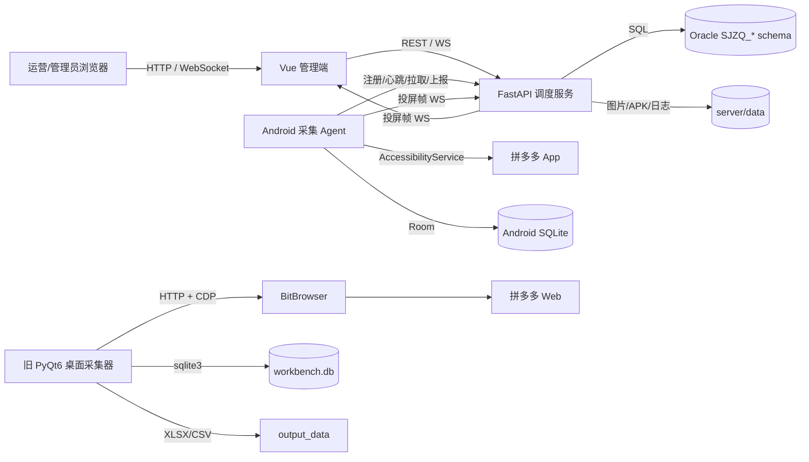
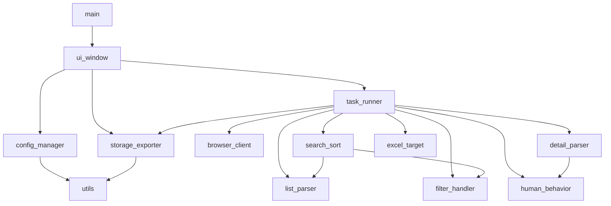
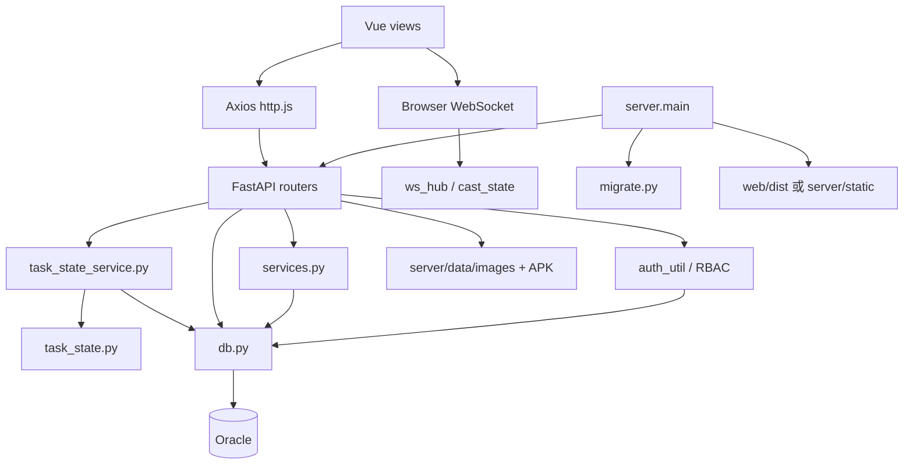
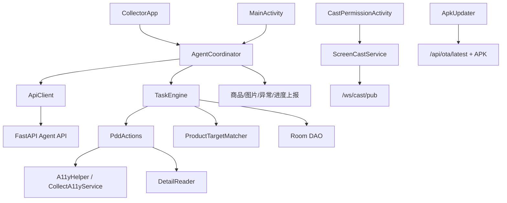
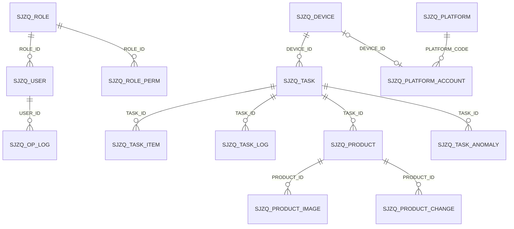

# 当前架构

> 本文描述当前代码实际呈现的架构，不代表目标架构。无法由代码和现有日志确认的部署信息标为 **UNKNOWN**。

## 1. 系统上下文

部署拓扑、反向代理、TLS、Oracle 所在网络、并发设备规模为 **UNKNOWN**。开发配置显示 Web 5173 代理到 FastAPI 8080；生产模式可由 FastAPI 托管 `web/dist`。

## 2. 组件依赖

### 2.1 旧桌面端

关键边界：

- UI 直接持有 `TaskRunner` 和 `StorageExporter`，没有应用服务/接口抽象。
- `TaskRunner` 同时负责线程状态、浏览器生命周期、采集策略、匹配、错误恢复和持久化编排。
- 解析模块直接依赖 Playwright 页面对象的动态行为，缺少稳定的页面快照契约。

### 2.2 服务端与 Web

路由按业务域拆分，但路由函数普遍直接书写 SQL、事务逻辑和响应转换；任务与任务项的业务状态例外，由 `task_state.py` 集中定义枚举/迁移/映射，并由 `task_state_service.py` 统一执行 Oracle 条件更新。设备连接/运行态仍由设备域维护。Web 页面也普遍直接调用 URL，前后端契约没有生成式客户端或共享 schema。

### 2.3 Android Agent

`AgentCoordinator` 是远程调度适配层；`TaskEngine` 是本地执行状态机；`PddActions` 是平台 UI 自动化实现。当前平台常量预留天猫、京东、抖音，但实际动作实现只有拼多多可确认。

## 3. 主要数据流

### 3.1 服务端调度采集

1. 管理员在 Vue 创建任务，页面调用 `POST /api/tasks`。
2. FastAPI 校验权限，将任务/任务项写入 `SJZQ_TASK`、`SJZQ_TASK_ITEM`；需审核的状态由代码规则决定。
3. Android Agent 通过 `POST /api/devices/register` 注册并周期性调用 heartbeat。
4. Agent 调用 `POST /api/tasks/pull`；服务端按设备、平台、状态和审核条件领取任务，并更新任务/设备状态。
5. `AgentCoordinator` 解析关键词/目标，启动 `TaskEngine`。
6. `TaskEngine` 通过无障碍服务操作拼多多，`DetailReader` 解析详情，本地结果先写 Room。
7. Agent 调用 `/api/tasks/progress` 上报进度/日志，调用 `/api/products/upload` 和图片接口上传数据，异常调用 `/api/tasks/{id}/anomalies`。
8. 服务端写 Oracle 商品、图片、任务日志/异常，并通过 `ws_hub` 通知管理端刷新。
9. Agent 调用 `/api/tasks/finish`；服务端结束任务并清理设备当前任务状态。

网络中断时本地与服务端状态如何去重、补偿和最终一致，只能从零散重试逻辑部分确认；完整保证为 **UNKNOWN**。

### 3.2 Excel 匹配

1. Web 上传 Excel 到 `/api/excel/match`。
2. 服务端用 openpyxl/xlrd 读取标题和行，规范化名称、规格、批准文号、厂家。
3. 服务端查询商品库并构造候选/匹配结果。
4. Web 展示结果，可导出回填后的工作簿，或把未匹配行转换为采集任务。
5. 导出时可从本地媒体目录或 URL 获取图片并写入工作簿。

### 3.3 商品生命周期

采集上传 → `SJZQ_PRODUCT`/`SJZQ_PRODUCT_IMAGE` → 管理端查询/编辑 → `SJZQ_PRODUCT_CHANGE` 记录变更 → 批量标记正式入库或软删除 → `T_GOODS_LIBRARY` 兼容视图供外部/后续流程读取。正式 `T_GOODS_LIBRARY` 表存在时的写入与同步责任为 **UNKNOWN**。

### 3.4 投屏

管理端请求 `/api/cast/{device_id}/start` → 服务端向设备控制通道发送开始指令 → Android 获取 MediaProjection 权限并连接 `/ws/cast/pub/{device_key}` → 服务端内存态 `cast_state` 转发帧 → 浏览器通过 `/ws/cast/view/{device_id}` 查看。服务重启会丢失内存会话状态。

### 3.5 旧桌面采集

UI 配置/关键词或 Excel → `TaskRunner` 工作线程 → BitBrowser API 创建/接管环境 → 搜索列表/排序 → 详情解析 → 过滤/目标匹配 → SQLite → Excel/CSV。该链路与 Oracle/Android 调度链路没有代码级共享数据库或同步过程。

## 4. 状态与持久化边界

| 状态 | 持久化位置 | 说明 |
|---|---|---|
| 用户/角色/权限/操作日志 | Oracle | 服务端唯一来源 |
| 任务/任务项 | Oracle | `task_state_service.py` 是业务状态修改入口；客户端状态只作协议映射 |
| 设备/任务日志 | Oracle | 设备连接态/运行态与任务业务状态分离 |
| 商品/图片元数据/变更 | Oracle | 图片二进制在文件系统 |
| APK 元数据/文件 | JSON + 文件系统 | `server/data/images/apk` |
| WS 连接/投屏房间 | 服务进程内存 | 重启不持久化 |
| Android 当前采集结果 | Room | 本地任务、商品 |
| Android 服务地址/设备键 | SharedPreferences | 设备本地 |
| 桌面采集结果 | SQLite + 文件 | 独立旧链路 |
| Web 登录 Token | localStorage | 浏览器本地 |

## 5. 安全与权限边界

- 管理 API 使用 JWT Bearer + Oracle RBAC；前端路由权限只影响展示，真正权限由 FastAPI dependency 执行。
- 部分 Agent API 通过 `device_key` 标识设备而非用户 JWT；设备密钥生成、轮换、撤销和传输保护策略 **UNKNOWN**。
- 投屏发布端通过设备键关联，查看端依赖管理权限/API 启动流程；WebSocket 的逐连接授权完整性需单独集成验证。
- 服务允许 `allow_origins=["*"]`、明文 Android 流量，并在源码中提供数据库/JWT/签名默认秘密；见 `issues.md`。

## 6. 数据模型关系（逻辑关系）

数据库没有声明外键，下图是从 SQL 和字段用途推导出的应用级关系：

## 7. 运行和发布架构

- 开发：Vite 5173 + FastAPI 8080；Vite 代理 `/api`、`/media`、`/ws`。
- 单体发布：先生成 `web/dist`，FastAPI 托管 SPA、API、媒体和 WebSocket。
- Android：Gradle 构建 APK，服务端 OTA 保存并发布 latest 元数据。
- 已存在 `server/run.ps1`，但没有发现 Dockerfile、Compose、CI 工作流、systemd/NSSM 配置或正式部署说明。
- 当前线上/沙箱进程由什么守护、如何启动、是否多实例、是否有负载均衡均为 **UNKNOWN**。
