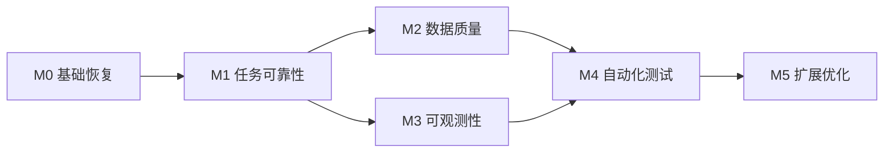

# 稳定数据采集系统升级路线图

> **Status: CURRENT FUTURE-STAGE AUTHORITY（2026-08-27）**
> 本文是未来阶段的权威入口，但路线项不等于实施授权；实际工作必须进入 [`backlog.md`](backlog.md) 并建立 Task。当前产品、实现和开放缺口分别见 [`../PRODUCT.md`](../PRODUCT.md)、[`CURRENT_STATE.md`](CURRENT_STATE.md)、[`gaps/current.md`](gaps/current.md)。

## 当前未来阶段边界

1. Accepted Business Baseline 已通过 PR #2 进入 `main@02234f2`，当前稳定能力到 Phase 6A。
2. `REPO-GOV-ALIGN-001` 只对齐治理基线，不改变业务路线。
3. Generic SKU runtime、正式 P1 SKU/ProductAttribute Schema、Phase 6B 与第二平台均为 NOT STARTED。
4. 下一业务阶段必须创建 Task/ADR、满足对应证据门禁并经 Product Owner 批准；下文旧 M0～M5 条目不构成授权。
5. `CI-ORACLE-LOCAL-GATE-001` 已通过 PR #6 merge 为 `main@b3a7e2c`：Oracle-sensitive PR 必须在固定 Head 本地隔离 Oracle strict 通过并提交 manifest；GitHub Actions 不连接数据库。该治理不启动或改变 Generic SKU、P1、P2、Phase 6B。

## 当前已批准执行顺序

```text
BL-110-WS-TENANT-BOUNDARY
→ WEB-RESULT-VISIBILITY-001
→ WEB-CLIENT-CONTRACT-001
→ WEB-TASK-IMPORT-001
→ WEB-STATE-UX-001
```

每项必须从前项 merge 后的 `main` 建立独立分支。第 1 项已通过 PR #5 普通 merge 为 `main@09e717c`；当前仅第 2 项 `WEB-RESULT-VISIBILITY-001` 获准执行。`WEB-TASK-IMPORT-001` 只统一手动输入与 Excel 导入到创建/下发任务流程，导出仍分别归 Task Detail、Product Library、Quality/Quarantine；不改变 draft→人工保存→资料库语义，不授权删除独立 Excel 菜单，也不进入 Generic SKU、Schema/P1 数据模型或 Phase 6B。状态以 [`backlog.md`](backlog.md) 为准。

> 制定日期：2026-08-13
> 依据：`docs/gap-analysis.md`、`docs/CURRENT_STATE.md`、`docs/architecture.md`、`docs/issues.md`
> 范围：从当前“功能型内部系统”升级为可构建、可恢复、可验证、可观测并可持续演进的稳定数据采集系统。
> 本文是实施路线图，不包含本阶段代码修改。尚未由运行环境或业务确认的事项标记为 **UNKNOWN**。

## 0. 执行优先级索引

路线图按里程碑描述演进顺序，实际领取任务必须遵循 **P0 → P1 → P2 → P3**。任务编号、代码落点和验收条件以 `docs/backlog.md` 为准，里程碑门禁以 `docs/milestone.md` 为准。

| 优先级 | 必须先完成的工作包 | 主要代码模块 | 对应里程碑 |
|---|---|---|---|
| P0 | BL-001～BL-011：工具链、依赖、秘密、Oracle 测试环境、迁移基线、状态机、租约、幂等、恢复、既有测试修复和最低门禁 | `requirements.txt`、`server/config.py`、`server/migrate.py`、`server/routers/tasks.py`、`devices.py`、`products.py`、`DetailReader.kt`/`DetailReaderTest.kt`、`AgentCoordinator.kt`、`ApiClient.kt`、`TaskEngine.kt` | M0、M1 |
| P1 | BL-101～BL-113：数据契约、质量校验、重试 outbox、结构化日志、指标告警、API 契约、安全收口和 Gradle bootstrap | `DetailReader.kt`、`detail_parser.py`、`server/routers/products.py`、`excel_match.py`、`server/main.py`、`auth_util.py`、`web/src/api/http.js`、Gradle wrapper/settings | M1、M2、M3、M4 |
| P2 | BL-201～BL-210：缓存评估、后台作业、多实例、模块边界、Room migration、容量、存储治理和已记录的工具链/Web 性能优化 | `excel_match.py`、`image_filter.py`、`ws_hub.py`、`cast_state.py`、`PddActions.kt`、`server/routers/*.py`、`web/vite.config.js` | M5 |
| P3 | BL-301～BL-305：桌面链路去留、多平台、运维体验、发布优化和文档收口 | 根目录桌面模块、`server/platforms.py`、Android platform adapter、Web 运维页面 | M5 |

任何 P2/P3 工作如果依赖尚未完成的 P0/P1 不变量，不得提前通过增加缓存、队列或新平台绕开前置问题。

## 1. 路线图原则

1. **先恢复基线，再增加能力**：M0 未通过前，不并行扩展业务功能或平台。
2. **先保证任务正确，再优化性能**：任务状态、租约、幂等和恢复优先于缓存、并发和多实例。
3. **服务端是调度权威源**：Oracle 中的任务、任务项和设备状态应形成唯一权威状态；Android/桌面状态只负责本地执行并显式映射。
4. **一条主链逐步闭环**：优先验证“创建→审核→领取→搜索→详情→上报→完成”，再扩展 Excel、OTA、投屏等旁路。
5. **每阶段必须可验证**：完成标准使用可执行命令、自动化检查、运行指标或演练记录判断，不以“代码已写”作为完成。
6. **避免大爆炸重构**：在现有分层内建立契约和测试保护，再逐步拆分大模块；每次变更保持单一目的。
7. **UNKNOWN 先决策再实现**：旧桌面端去留、唯一键、投递语义、容量目标等必须在对应阶段入口前确认。

## 2. 阶段依赖总览



说明：

- M0、M1 是严格串行门槛。
- M2 与 M3 在 M1 状态/标识稳定后可部分并行，但 M2 的质量指标应接入 M3，M3 的追踪字段应复用 M1 的任务/尝试标识。
- M4 不是最后才开始写测试：M0–M3 每阶段都必须同步补最低测试；M4 的重点是把零散测试体系化并形成统一门禁。
- M5 只能建立在可靠性、数据质量、监控和测试基线之上。

## 3. 阶段门禁摘要

| 阶段 | 核心结果 | 入口依赖 | 出口门禁 |
|---|---|---|---|
| M0 基础恢复 | 当前源码可重复构建、配置可控、迁移可复现 | 当前代码与文档 | 干净环境构建/启动基线通过 |
| M1 任务可靠性 | 任务不会永久卡死，重复请求不破坏状态/数据 | M0 | 状态机、租约、幂等、断线恢复测试通过 |
| M2 数据质量 | 采集结果可校验、可追溯、可恢复 | M1 | 字段质量阈值、去重、一致性和备份恢复通过 |
| M3 可观测性 | 故障可发现、可定位、可处置 | M1；复用 M2 质量规则 | 指标、日志、告警、追踪和演练闭环通过 |
| M4 自动化测试 | 关键变更进入统一回归门禁 | M2 + M3 | 单元/集成/契约/E2E/故障测试稳定运行 |
| M5 扩展优化 | 按测量结果扩容、缓存、拆分和多平台 | M4 | 容量与回归指标达标，扩展不降低稳定性 |

---

## M0 基础恢复

> **当前进度（2026-08-13）**：进行中。T001（BL-001、BL-002）已验收 DONE，完成 Python 干净安装与核心导入、Web 干净安装与 production build、Android debug assemble、工具链约束和开发环境文档。M0 当前剩余 BL-003、BL-010、BL-004、BL-011、BL-009 基础部分；其中测试 Oracle 缺失阻塞完整 lifespan/readiness 与迁移验证，`DetailReaderTest` 仍有 3 项既有失败。

### 目标

- 建立一套从干净工作目录可重复安装、构建、启动和验证的工程基线。
- 明确 Python、Node、JDK、Android SDK、Gradle、Oracle client/schema 的受支持版本。
- 修复依赖清单、配置来源、秘密管理和数据库初始化/迁移流程的基础缺口。
- 形成后续阶段共同使用的本地/测试环境与最小验证命令。

### 背景

T001 已消除最初的依赖与工具链阻断：`requirements.txt` 已补齐并固定直接依赖，Node 22.18.0/npm 10.9.3 下 Web production build 通过，JDK 17.0.20/Gradle 8.4/SDK 34 下 Android debug assemble 通过。剩余基础问题是源码秘密与配置校验、Oracle 测试环境/schema 迁移基线、3 项 `DetailReaderTest` 失败以及最低自动门禁。Gradle 首次联网下载、SDK XML 警告和 Web 大 chunk 已分别进入 P1/P2，不阻断 T001 完成。

### 涉及模块

- 根目录：`requirements.txt`、README、运行脚本、`.gitignore`。
- 服务端：`server/config.py`、`server/.env` 模板、`server/main.py`、`server/db.py`、`server/init_schema.py`、`server/init_rbac_schema.py`、`server/migrate.py`、`server/run.ps1`。
- Web：`web/package.json`、`web/package-lock.json`、`web/vite.config.js`、`web/README.md`。
- Android：`android_collector/build.gradle.kts`、`app/build.gradle.kts`、Gradle wrapper、`local.properties.example`、构建/发布脚本。
- 文档与工程：构建说明、环境矩阵、配置模板、决策记录、基础 CI 定义。

### 技术方案方向

1. **固定工具链**
   - 明确并锁定受支持的 Python、Node、npm、JDK 17、Android SDK/AGP/Kotlin 版本。
   - Web 在 `package.json` 声明 `engines`，锁文件与 Node 版本组合经构建验证。
   - Android 使用 Gradle wrapper，记录 SDK package 与 `JAVA_HOME` 要求。

2. **依赖闭环**
   - 依据代码实际 import 对齐 Python 依赖，确保干净虚拟环境可导入服务端和桌面端。
   - 保留可重复锁定策略；具体采用 constraints、锁文件或现有工具的方案需记录技术决策。
   - 验证 OCR、Oracle 和 Playwright 等可选/外部运行时依赖，区分必需与可选能力。

3. **配置与秘密分离**
   - 数据库密码、JWT secret、Android release 签名口令只通过环境/本机/CI secret 提供。
   - 配置模型增加类型、必填、范围和交叉校验；生产环境不得回退到弱默认秘密。
   - 建立 `.env.example`、环境差异表、配置优先级和启动失败规则。

4. **数据库基线与迁移入口统一**
   - 盘点当前 Oracle 实际 schema（只读）并建立版本基线。
   - 将“空库初始化”和“增量补丁”纳入同一可版本化迁移流程；迁移与服务启动解耦或加单实例锁。
   - 迁移需记录版本、执行状态、校验值和失败恢复方式。

5. **最小运行验证**
   - 服务端：导入、配置校验、测试 Oracle 连接、schema 检查、health/readiness。
   - Web：安装和 production build。
   - Android：assemble 与现有 unit tests。
   - 桌面端：模块导入和不启动真实采集的 smoke check；真实 BitBrowser 验证作为独立验收。

6. **工作区卫生与制品来源**
   - 区分源码、依赖、构建产物、运行数据和发布制品。
   - 为 `web/dist`、APK、schema 版本建立可追溯的源码版本与构建记录。

### 依赖关系

- 输入依赖：当前代码、现有运行日志、可用的 Oracle 测试环境、Android SDK/JDK、Node 版本决策。
- 业务决策：确认旧桌面端是否属于必须构建/发布的正式产品；若 **UNKNOWN**，M0 至少保留静态验证，暂不删除。
- 输出被 M1–M5 共同依赖：稳定测试环境、配置模型、迁移基线和统一构建命令。

### 风险

- 当前 Oracle schema 可能与初始化代码漂移，直接统一迁移可能破坏已有数据。
- 秘密移除后，历史部署若依赖源码默认值可能无法启动。
- Node/Android 工具链升级可能触发大量间接依赖变化。
- mojibake 的原始正确文本来源 **UNKNOWN**，批量修复可能改变业务判断字符串；应独立盘点，不在 M0 无证据替换。
- 当前目录不是可由 `git` 命令识别的仓库，变更追踪和制品来源需要先确认实际版本控制方式。

### 完成标准

- 在记录的干净环境中，Python 依赖安装与关键模块导入通过，不再出现 `ModuleNotFoundError: jwt`。
- `npm ci`/等价锁定安装和 `npm run build` 在规定 Node 版本下通过，产物来源可追溯。
- Android `assemble` 与现有 `testDebugUnitTest` 在规定 JDK/SDK 下运行并报告实际结果。
- 服务端使用测试配置可启动，liveness/readiness 能区分进程存活和 Oracle/OCR 等依赖状态。
- 数据库迁移可从已定义基线升级到当前版本；重复执行无额外副作用；失败恢复流程经过测试环境验证。
- 仓库/部署配置中不再依赖硬编码生产秘密；缺少关键秘密时启动明确失败。
- 形成一份可执行的环境矩阵、安装/构建/启动/回滚文档和最小 smoke 命令清单。
- M0 相关自动化检查进入统一脚本或初始 CI；全部结果可重复，不依赖现有未说明缓存。

### 当前建议执行顺序

1. **T002 / BL-003**：外置秘密并增加配置启动校验（当前无外部测试库依赖，可立即开发）。
2. **BL-010**：建立隔离 Oracle 测试环境；与 T002 的配置注入方式对齐。
3. **BL-004**：在隔离 Oracle 上建立并验证 schema 版本基线。
4. **BL-011**：修复 3 项 `DetailReaderTest` 既有失败。
5. **BL-009（M0 部分）**：将以上构建、启动、迁移和测试纳入最低门禁。

---

## M1 任务可靠性

### 目标

- 建立服务端权威的任务、任务项、设备和执行尝试状态模型。
- 确保任务在并发领取、重复请求、Agent 崩溃、网络分区和服务重启后能够恢复或进入明确待处理状态。
- 明确投递语义，使用租约、幂等、重试和补偿避免永久卡死、重复计数和重复数据。

### 背景

当前已有创建、审核、领取、进度、完成、失败项重排、设备心跳和 Android 执行协调，但状态枚举分散：服务端使用 `pending/running/done/failed/cancelled`，Android 使用 `running/finished/stopped/failed`，桌面端还有 `paused/interrupted` 等状态。代码未形成单一状态机，未发现完整的任务租约、续租、过期回收、进度序号、持久化上报队列和全链路幂等保证。

### 涉及模块

- 服务端：`server/routers/tasks.py`、`devices.py`、`products.py`、`server/services.py`、`server/schemas.py`、`server/db.py`、任务/设备/日志相关 schema 和迁移。
- Android：`AgentCoordinator.kt`、`ApiClient.kt`、`TaskEngine.kt`、Room entities/DAO。
- 实时通道：`server/ws_hub.py`（仅通知，不作为权威状态源）。
- 旧桌面端：`task_runner.py`、`storage_exporter.py`（明确映射或隔离，不与服务端状态混为一体）。
- Web：任务创建、审核、列表、详情和设备状态页面。

### 技术方案方向

1. **权威状态机**
   - 为任务、任务项、设备运行态和审核态分别定义枚举、合法迁移、终态和不变量。
   - 状态迁移集中到业务服务，不由 router、SQL 和客户端各自决定。
   - 明确取消、超时、部分成功、重新排队和人工重放语义。

2. **执行尝试与租约**
   - 为每次领取创建 `attempt_id`，记录 Agent、领取时间、租约截止、心跳和尝试次数。
   - Agent 周期续租；租约过期由服务端 reconciliation 任务回收或转人工状态。
   - 使用数据库条件更新/锁保证同一任务只产生一个有效执行尝试。

3. **幂等协议**
   - 创建、领取、进度、商品、图片、异常、完成接口定义 idempotency key 和重复响应。
   - 进度带单调序号或版本，拒绝旧尝试/旧序号覆盖新状态。
   - 商品和图片写入使用明确业务键/上传键，计数从权威明细聚合或使用去重事件更新。

4. **持久化上报与重试**
   - Android 建立本地 outbox/待上报记录；任务执行和待上报写入保持可恢复关系。
   - 网络错误按可重试/永久/访问限制/解析/数据校验分类，采用受控退避和总时限。
   - 超出策略的请求进入 dead-letter/人工处理，而不是无限静默轮询。

5. **一致性巡检与补偿**
   - 周期检查任务、任务项、设备 `CURRENT_TASK_ID`、租约和计数不变量。
   - 修复策略必须可审计，自动修复和人工修复边界明确。
   - 服务启动不直接猜测并重置所有运行态；依据租约和 attempt 处理。

6. **兼容与发布顺序**
   - API/schema 先向后兼容，再升级 Agent，最后启用新协议的强校验。
   - 明确最低兼容 Android 版本，利用 OTA 做分批升级和回滚。

### 依赖关系

- 强依赖 M0：可运行测试环境、版本化 schema、稳定配置和可构建 Agent/API。
- 必须提前确认：任务投递语义、任务超时、最大重试、商品唯一键、Agent 并发模型。
- M2 依赖 M1 的 `task_id/item_id/attempt_id` 和幂等写入建立数据追溯。
- M3 依赖 M1 的状态事件、尝试和错误分类建立指标/告警。

### 风险

- 旧 Agent 与新状态协议并存时可能产生错误映射或重复执行。
- Oracle 条件更新/锁策略不当会导致争用、死锁或吞吐下降。
- at-least-once 投递要求下，如果业务写入没有完整幂等，重复上报仍可能污染数据。
- 自动回收阈值过短会抢占慢任务，过长会延迟恢复。
- 桌面端是否纳入服务端调度为 **UNKNOWN**；不得在未决策时强行合并两套运行模型。

### 完成标准

- 状态机、合法迁移和客户端映射形成版本化文档并由代码测试覆盖。
- 并发 Agent 领取同一任务的测试中仅一个 attempt 获得有效租约。
- 重复 progress/product/image/finish 请求不会重复计数、重复终结或产生非预期重复数据。
- 模拟 Agent 断电、网络中断、服务重启和超时后，任务能在规定时间内续跑、重排或进入明确人工状态。
- 旧 attempt 的迟到请求不能覆盖新 attempt 状态。
- reconciliation 能发现并处理预定义的不一致，所有修复有审计记录。
- 关键故障场景形成可自动执行的集成测试，且给出实际通过结果。
- Web 能显示排队、执行 attempt、重试/超时、终态及可执行处置，不依赖日志猜测状态。

---

## M2 数据质量

### 目标

- 建立从采集证据到标准商品记录的可追溯数据链。
- 对字段完整性、格式、范围、一致性、去重和来源进行可执行校验。
- 保证 Oracle、图片文件、Android Room 与导出结果之间的关键一致性，并具备备份恢复能力。

### 背景

当前可采集名称、价格、销量、规格、SKU、批准文号、厂家、图片等字段，也有原始 JSON、变更记录和 Excel 匹配；但页面操作、解析、标准化和存储耦合，缺少解析器版本、字段质量规则、固定样本和质量指标。Oracle 没有声明逻辑关系外键，商品自然键/上报幂等尚未最终确定；Room 没有 migration；图片为数据库元数据 + 本地文件双存储。

### 涉及模块

- Android：`DetailReader.kt`、`PddActions.kt`、`ProductTargetMatcher.kt`、`ImageCaptureHelper.kt`、Room entities/DAO。
- 桌面：`detail_parser.py`、`list_parser.py`、`excel_target.py`、`filter_handler.py`、`storage_exporter.py`。
- 服务端：`products.py`、`excel_match.py`、`image_filter.py`、`reports.py`、商品/图片/变更/任务项 schema。
- 文件系统：`server/data/images`、Excel/CSV 导出目录。
- 数据库：Oracle schema、索引、约束、兼容视图 `T_GOODS_LIBRARY`。

### 技术方案方向

1. **数据契约与字段字典**
   - 定义字段类型、单位、是否必填、允许范围、空值语义、来源和标准化规则。
   - 明确列表字段、详情字段、OCR 字段、推导字段和人工修改字段的优先级。
   - 定义商品业务唯一键和采集快照/当前商品的关系。

2. **采集证据与版本追溯**
   - 每条结果关联 platform、App/Web 版本、parser/selector 版本、task/item/attempt、采集时间和原始证据摘要。
   - 原始文本/JSON/必要截图采用受控保留，不把敏感或无限增长内容无条件永久保存。

3. **分层质量处理**
   - 页面获取 → 原始解析 → 标准化 → 业务校验 → 去重/合并 → 持久化分层。
   - 校验失败进入 quarantine/待复核状态，并保留原因，不用默认值静默伪造完整数据。
   - 对价格、销量、批准文号、规格、SKU、图片等建立字段级规则。

4. **样本与回归基线**
   - 建立脱敏、可版本化的列表页/详情页/无障碍节点/文本样本库。
   - 为典型、边界、异常、改版和 OCR 场景定义期望字段。
   - 对解析器升级输出差异报告，人工批准预期变化。

5. **数据库完整性与一致性**
   - 根据 Oracle 当前数据审计结果决定外键、唯一约束、检查约束或应用级验证。
   - 建立 orphan/重复/缺图/文件丢失/计数漂移巡检。
   - `T_GOODS_LIBRARY` 的表/视图形态和同步责任必须形成明确决策。

6. **生命周期与恢复**
   - 定义原始证据、商品、图片、日志、APK 的保留/归档/清理周期。
   - 建立 Oracle 与文件存储备份、恢复和一致性校验流程。
   - Room schema 开启导出并提供 migration；本地数据与服务端上报完成状态可核对。

### 依赖关系

- 强依赖 M1：稳定 attempt、幂等键、任务/任务项状态和上报语义。
- 依赖业务确认：商品唯一键、字段必填规则、人工修改优先级、图片和原始证据保留期限。
- 向 M3 输出质量指标、异常分类和巡检结果。
- 向 M4 输出解析样本、数据契约和迁移/恢复测试用例。

### 风险

- 对历史数据直接增加唯一/外键约束可能因存量脏数据失败。
- 过严规则会误隔离可用商品；过松规则无法检测解析退化。
- 保存过多截图/原始页面会造成存储增长和敏感数据风险。
- Android 与桌面解析结果可能无法立即统一；需要明确权威链路和兼容期。
- 商品合并规则错误可能造成不可逆的数据串并。

### 完成标准

- 核心商品字段字典、唯一键、空值/单位/标准化规则经业务确认并版本化。
- 每条正式商品记录可追溯到 task、item、attempt、采集端版本和解析版本。
- 固定样本集覆盖主要字段与异常类型，解析回归达到已批准的准确率/完整率阈值。
- 无效数据进入可查询 quarantine，不能静默进入正式商品库。
- 重复商品、孤儿记录、缺失文件和计数漂移巡检可自动执行并产生明确结果。
- schema/Room migration 在存量样本副本上通过；回滚或前向修复方案经过验证。
- Oracle 与图片文件备份恢复演练完成，恢复后引用完整性检查通过。
- Excel 匹配/导出对数据契约有回归测试，结果与源商品字段可核对。

---

## M3 可观测性

### 目标

- 让服务、依赖、设备、任务、采集质量和存储状态可测量、可关联、可告警。
- 支持从一个失败任务快速定位到请求、设备、attempt、步骤、错误分类和原始证据。
- 定义适合当前规模的 SLI/SLO、告警阈值和故障处置流程。

### 背景

当前存在 Uvicorn/Loguru 日志、Oracle 任务/操作/异常日志、设备 heartbeat、dashboard summary 和 `/api/health`，但缺少统一结构化字段、指标端点、时间序列存储、分布式追踪、告警和 SLO。部分宽泛异常捕获会丢失根因，投屏/WS 状态仅在单进程内存。

### 涉及模块

- 服务端入口与中间件：`server/main.py`、`auth_util.py`、`services.py`、所有 router、`db.py`。
- 调度与设备：`tasks.py`、`devices.py`、`ws_hub.py`、`cast_state.py`。
- Android：`AgentCoordinator.kt`、`ApiClient.kt`、`TaskEngine.kt`、采集动作与异常上报。
- 桌面：`utils.py`、`task_runner.py`、Loguru 配置。
- Web：dashboard、task detail、device pages、operation logs、settings。
- 运维：日志采集、指标后端、告警渠道、dashboard 与 runbook；具体产品选型 **UNKNOWN**。

### 技术方案方向

1. **统一遥测模型**
   - 全链路字段至少包含 `request_id`、`task_id`、`item_id`、`attempt_id`、`device_id`、`platform`、`app_version`、`parser_version`。
   - 错误采用稳定 `error_code/error_class/retryable/stage`，消息用于人读，不作为程序判断依据。

2. **结构化日志**
   - 服务端、Agent 和桌面端输出统一结构化格式或可稳定解析格式。
   - 保留异常堆栈、关键状态变化和外部调用结果，同时脱敏 token、密码、设备密钥和业务敏感值。
   - 定义轮转、保留、集中检索和磁盘保护。

3. **指标体系**
   - 服务：请求量、延迟、错误率、线程/连接池、Oracle 调用、WS 连接。
   - 调度：排队量、领取延迟、运行时长、租约过期、重试/死信、状态分布。
   - 采集：搜索/详情成功率、阶段耗时、访问异常、空结果、字段完整率、解析失败率。
   - 设备：在线率、心跳延迟、版本分布、连续运行/休息、崩溃/异常次数。
   - 存储：连接池、查询延迟、表/文件增长、磁盘空间、备份与巡检结果。

4. **健康与就绪**
   - liveness 只判断进程状态；readiness 检查必要依赖并设置明确超时。
   - 健康响应不泄露 DSN、秘密或内部路径。
   - 外部依赖探测区分必需与可选，避免 OCR 可选失败导致整个服务错误下线。

5. **追踪与事件**
   - HTTP、DB、Agent 上报和后台任务至少通过 correlation ID 串联；是否引入 OpenTelemetry 由规模和运维条件决定。
   - 状态迁移产生结构化事件，支持还原任务时间线。

6. **告警与 SLO**
   - 先定义少量高信号告警：服务不可用、Oracle 不可用、任务长期不推进、租约过期激增、设备大面积离线、采集成功率/字段质量骤降、磁盘不足。
   - 每个告警绑定责任人、抑制规则、确认方式和 runbook。
   - SLO 数值需依据实际吞吐与业务容忍度确认，当前为 **UNKNOWN**。

### 依赖关系

- 依赖 M1 的 attempt、状态机和错误分类，避免指标口径漂移。
- 依赖 M2 的字段质量规则产生质量指标；M3 可先搭平台，M2 稳定后接入完整质量面板。
- 为 M4 的故障测试提供可观察断言，为 M5 容量和缓存决策提供基线。
- 外部依赖：指标/日志/告警后端与通知渠道选型；未确认前应保持采集接口可替换。

### 风险

- 高基数字段或逐动作日志可能造成遥测成本和存储爆炸。
- 采集截图、页面文本、请求体可能包含敏感信息，不能无选择进入日志。
- 告警阈值未经基线校准会造成告警风暴或漏报。
- 同步上报遥测可能反向影响采集和 API 性能，必须异步/批量或有降级。
- 仅建设 dashboard 而没有处置责任与演练，会形成“可看但不可用”的监控。

### 完成标准

- 任一任务可按 `task_id` 查看从创建到终态的状态时间线，并关联 item、attempt、device 和关键错误。
- 服务端日志为结构化且经过脱敏；异常保留堆栈；日志轮转和保留策略生效。
- liveness/readiness 分离，依赖故障时返回符合设计的状态且不泄露内部配置。
- 核心服务、调度、采集、设备、数据质量和存储指标可查询，口径有文档。
- 至少对服务/Oracle不可用、任务卡死、设备离线、成功率下降、磁盘不足建立告警与 runbook。
- 通过一次故障演练证明告警触发、定位、处置和恢复记录闭环。
- 遥测开销在定义预算内；遥测后端不可用不会阻断任务主链。

---

## M4 自动化测试

### 目标

- 将 M0–M3 的零散验证建设为分层、稳定、可在统一门禁中运行的自动化测试体系。
- 覆盖任务可靠性、数据质量、API 契约、采集解析、数据库迁移和主要 Web 管理路径。
- 让每次变更能够快速判断是否破坏核心采集链和运维保证。

### 背景

当前只有 Android 3 个 JUnit 类和依赖真实环境的桌面 `run_test.py`；服务端和 Web 未发现项目自有自动化测试。现有 Android 测试在本机因缺 JDK 未运行，Web 当前环境无法构建。M0–M3 会逐步补充最低测试，本阶段负责统一结构、数据夹具、门禁、覆盖策略和故障验证，而不是把测试推迟到开发结束。

### 涉及模块

- 服务端：全部 routers、services、auth、db、migration、schemas、image/excel 逻辑。
- Web：router/store/http、任务/设备/商品/Excel/RBAC 关键页面。
- Android：engine、parser、matcher、network protocol、Room migration、Coordinator。
- 桌面：列表/详情解析、匹配、存储、任务状态；是否纳入正式全量门禁取决于去留决策。
- 测试基础设施：Oracle 测试 schema/容器替代方案（Oracle 可用方式 **UNKNOWN**）、HTTP/WS 模拟 Agent、固定采集样本、CI runner、制品与报告。

### 技术方案方向

1. **测试分层**
   - 单元：状态机、错误分类、匹配、标准化、解析和配置校验。
   - 集成：Oracle repository/迁移、任务领取、幂等上报、文件/图片一致性、Room migration。
   - 契约：OpenAPI/JSON 字段、枚举、错误、兼容旧 Agent；Vue/Android 消费方验证。
   - E2E：Web 创建任务 → 模拟 Agent 领取/上报 → Web 查看结果。
   - 真机/真实页面：少量固定版本验收，不作为所有提交的快速门禁。

2. **可重复夹具**
   - 建立最小 Oracle schema 与种子；每个测试隔离数据并可清理。
   - 建立脱敏列表/详情/无障碍节点/图片/Excel 样本。
   - 时间、随机、网络和设备响应可控，避免依赖真实外部页面产生抖动。

3. **可靠性与故障测试**
   - 并发领取、重复 progress/finish、迟到 attempt、网络超时、Agent 崩溃、服务重启、Oracle 短暂故障。
   - 验证状态不变量、幂等、租约回收、outbox 重放和死信。

4. **质量与迁移测试**
   - 解析 golden test、字段质量阈值、OCR 分类样本、Excel round-trip。
   - Oracle 和 Room 从已支持版本迁移到当前版本，并验证数据保持。
   - 备份恢复和一致性巡检使用自动化脚本验证。

5. **Web 与 API 测试**
   - 组件/逻辑测试覆盖权限、错误处理和状态展示。
   - 浏览器 E2E 覆盖登录、任务创建/审核、设备/任务详情、商品查询和失败处置。
   - 不以大量脆弱视觉选择器替代领域/API 测试。

6. **门禁与报告**
   - 快速测试用于每次提交，集成/E2E/Android 用分层流水线运行。
   - 固定失败保留日志、数据库快照摘要、截图和关联 ID。
   - 管理 flaky test；禁止长期无责任跳过。

### 依赖关系

- 依赖 M0 的工具链和测试环境。
- 依赖 M1 的状态机/协议作为可靠性断言。
- 依赖 M2 的数据契约和样本作为质量断言。
- 依赖 M3 的结构化日志/指标帮助诊断测试失败和故障注入结果。
- M5 的缓存、性能、拆分和多平台工作必须经过 M4 门禁。

### 风险

- 真实拼多多页面和无障碍树变化会导致真机测试不稳定。
- Oracle 测试环境建立成本可能高，使用替代数据库会掩盖 Oracle 语义差异。
- 历史代码耦合严重，若先大规模 mock 实现细节，测试会脆弱且价值低。
- 为追求覆盖率数字可能遗漏状态不变量和故障行为。
- E2E 数量过多会拖慢反馈；需严格分层。

### 完成标准

- 统一命令可运行 Python 服务端测试、Web 测试/构建、Android unit tests 和契约检查。
- 核心任务主链至少有一条完全自动化 E2E：创建→审核→领取→进度/商品→完成→管理端查询。
- M1 定义的并发、重复、断线、迟到和恢复场景全部有自动化测试。
- 核心解析字段、Excel、OCR 分类和数据质量规则有版本化样本回归。
- Oracle/Room migration、备份恢复关键步骤有自动化验证。
- Web 关键权限和失败处置路径有测试；API 消费方契约不一致会在发布前失败。
- 流水线输出测试结果、失败证据和制品；flaky rate 在约定阈值内，所有跳过项有期限和负责人。
- 覆盖率阈值按模块风险设置；最终验收以关键行为/不变量覆盖为主，不只看行覆盖率。

---

## M5 扩展优化

### 目标

- 基于 M3 指标和 M4 测试结果优化吞吐、延迟、资源使用和部署弹性。
- 在有明确热点时引入缓存和后台作业边界。
- 降低大型模块和重复采集链路的维护成本，并为多实例、多设备和后续多平台扩展建立稳定接口。

### 背景

当前没有通用缓存；FastAPI 请求路径承担同步 Oracle、Excel、OCR、图片下载等工作；WebSocket/投屏状态是单进程内存；核心采集与路由文件过大；Android 与桌面重复实现领域能力。实际设备数、吞吐、延迟、容量目标和多平台优先级均为 **UNKNOWN**，因此优化必须以测量为依据。

### 涉及模块

- 服务端：查询/报表、Excel、OCR、图片、任务调度、WS/投屏、DB pool、配置和部署入口。
- 缓存/作业基础设施：抽象层及可能的 Redis/队列/对象存储；具体技术选型 **UNKNOWN**。
- Android：采集 adapter、网络批量、Room/outbox、OTA 兼容。
- 桌面：保留/冻结/共享规则/退役范围。
- Web：大数据分页、实时更新、运维工作台和性能体验。
- 部署：多实例、负载均衡、共享状态、容量测试、灰度和回滚。

### 技术方案方向

1. **性能基线与容量模型**
   - 基于 M3 数据确定瓶颈：DB、OCR、Excel、图片、Agent 轮询、WS 或前端渲染。
   - 定义设备数、任务吞吐、P95/P99 延迟、存储增长和资源预算。
   - 建立可重复负载测试，优化前后对比。

2. **缓存按需引入**
   - 只缓存读多写少、允许短暂陈旧的数据，如平台字典、权限、部分 dashboard 聚合或稳定商品查询。
   - 通过缓存接口隔离实现，明确 key、TTL、版本、失效、容量、穿透/击穿和降级。
   - 任务权威状态、租约和幂等不得依赖不可靠的普通缓存；若使用 Redis 做协调需另行设计一致性。

3. **后台作业与资源隔离**
   - 将 Excel 解析/导出、OCR、批量图片处理、清理和报表等长任务移入可持久化作业。
   - 定义队列、优先级、并发、超时、取消、进度、重试和死信。
   - API 只提交作业和查询状态，避免长请求占用服务线程。

4. **多实例与共享状态**
   - WS/投屏需要 sticky session、共享 broker 或独立网关；按实际规模选择。
   - 调度租约和 reconciliation 保持数据库/协调服务权威，验证多实例并发。
   - 文件存储如需多实例，评估共享卷或对象存储，并保持引用一致性。

5. **渐进式模块化**
   - 在 M4 测试保护下，把 router 中领域逻辑下沉 service/repository。
   - Android 按平台 adapter、动作、解析、质量和上报边界拆分 `PddActions`/`TaskEngine`。
   - 抽取跨端共享的是数据契约和测试样本，不强行共享不适合跨语言的实现。

6. **旧桌面链路决策**
   - 若保留：明确功能范围、独立发布和与服务端的数据同步协议。
   - 若冻结/退役：提供数据迁移、能力替代、回滚窗口和文档归档。
   - 不允许无限期维持两套“默认主链”。

7. **多平台扩展**
   - 先定义平台 adapter 接口、能力矩阵、字段映射和平台级测试套件。
   - 拼多多适配器通过接口回归后，再按业务优先级逐个平台实现。
   - 服务端已有的天猫/京东/抖音占位不得直接标记为完成。

### 依赖关系

- 强依赖 M4 门禁，所有优化必须有回归保护。
- 依赖 M3 性能/容量指标决定是否需要缓存、队列、多实例和对象存储。
- 依赖 M1 可靠任务协议，后台作业/多实例不得破坏租约和幂等。
- 依赖 M2 数据契约，模块拆分和多平台必须输出一致标准数据。
- 业务前置：目标设备数、吞吐/SLO、旧桌面去留、多平台优先级和预算。

### 风险

- 无指标提前引入 Redis/消息队列/微服务会增加运维复杂度而不解决真实瓶颈。
- 缓存失效错误可能展示过期任务/权限或污染调度判断。
- 后台作业与主任务形成第二套状态机，若未复用 M1 原则会重新引入卡死问题。
- 多实例下 WS、文件和内存状态不共享会出现局部可用、全局不一致。
- 大模块拆分可能改变采集时序和页面交互行为，必须小步迁移。
- 多平台会显著放大解析、设备、字段和测试矩阵，不应与稳定化并行抢占资源。

### 完成标准

- 形成经批准的容量目标和基线报告；负载测试达到目标吞吐与延迟，错误率和资源使用在预算内。
- 每一项缓存都有命中率、TTL/失效规则、降级和一致性测试；未证明收益的缓存不进入生产。
- Excel/OCR/图片等长任务从同步请求隔离后，可查询进度、取消、重试并恢复。
- 多实例部署（如确有需求）通过任务领取、WS/投屏、文件访问和故障切换测试。
- 关键大模块按明确边界缩减职责，API/行为回归保持通过，无无关重构。
- 旧桌面端有正式的保留、冻结或退役结论及执行记录。
- 新平台只有在 adapter、字段契约、样本回归、监控和验收全部通过后才标记为支持。
- 优化前后指标对比可证明收益，且不降低 M1–M4 的可靠性、数据质量、可观测性和测试门禁。

---

## 4. 跨阶段决策清单

以下决策应在标注阶段入口前完成并记录到 `docs/decisions/`：

| 决策 | 最晚阶段 | 当前状态 |
|---|---|---|
| 受支持 Python/Node/JDK/Android SDK 版本 | M0 | UNKNOWN |
| Oracle 当前 schema 基线与迁移工具/流程 | M0 | UNKNOWN |
| 秘密存储、轮换和部署注入方式 | M0 | UNKNOWN |
| 旧桌面端是否是正式主链/兼容链/待退役 | M1 | UNKNOWN |
| 任务投递语义、租约与超时 | M1 | UNKNOWN |
| 商品业务唯一键与重复合并规则 | M1/M2 | UNKNOWN |
| 数据字段必填、质量阈值和人工修订优先级 | M2 | UNKNOWN |
| 原始证据、图片、日志和 APK 保留期限 | M2/M3 | UNKNOWN |
| SLO、告警责任人和通知渠道 | M3 | UNKNOWN |
| Oracle 自动测试环境方案 | M4 | UNKNOWN |
| 目标设备数、吞吐、延迟和部署实例数 | M5 | UNKNOWN |
| 缓存/作业/对象存储是否有真实需求 | M5 | UNKNOWN |
| 多平台优先级和验收标准 | M5 | UNKNOWN |

## 5. 路线图完成定义

整个升级路线图完成，不仅意味着功能存在，还应同时满足：

- 当前源码可由规定工具链稳定重建和发布。
- 任务在重复、并发、断线和重启下有确定、可验证的结果。
- 数据可追溯、可校验、可去重、可备份恢复。
- 核心故障能通过指标/日志/告警发现，并有处置手册和演练记录。
- 核心行为进入自动化门禁，接口和 schema 演进受契约测试保护。
- 缓存、队列、多实例和多平台等复杂度仅在指标和业务需求证明必要时引入。

## Phase 6A Collector Abstraction 执行状态（2026-08-19）

- **ACCEPTED**：最小 Collector Contract、Registry、Capability、统一 Identity/System Error 与 PddAdapter 已实现。
- PDD 通过 before/after、真实 Oracle Product/Snapshot/Quality/Quarantine/Diff/idempotency compatibility。
- Phase 1～6A exhaustive Oracle：`40/40 PASS`，无 skip；全量严格入口：`PASS=4 FAIL=0 BLOCKED=0`。
- 核心 Task/Job/Quality/Tenant/Quota 层不依赖 PDD 原始响应或平台条件链。
- Phase 6B：**NOT STARTED**。本记录不授权或启动 JD、淘宝、1688 等第二平台实现，启动仍需 Product Owner 明确批准。
# Phase 4 执行状态（2026-08-17）

# Phase 5.5 企业化硬化执行状态（2026-08-17）

Phase 5.5 只关闭 Phase 5 的企业隔离硬化债务：设备 enrollment/revoke、旁路 TenantContext、三类配额账本与 legacy/default 退出门禁。它不引入新平台、缓存、队列、broker 或 Phase 6 产品范围。实现与离线专项测试已完成；真实 Oracle 门禁通过前，Phase 6 不具备无条件启动条件。

管理与可观测性已按 `docs/decisions/phase4-management-observability.md` 实施；本阶段只增加既有 Phase 2/3 事实的管理查询、真实分页、服务端质量聚合和排查型 Web 页面，不改变已稳定的写入架构。最终测试与限制见 `docs/tasks/phase4-acceptance.md`，完成后停止，不进入 Phase 5。
