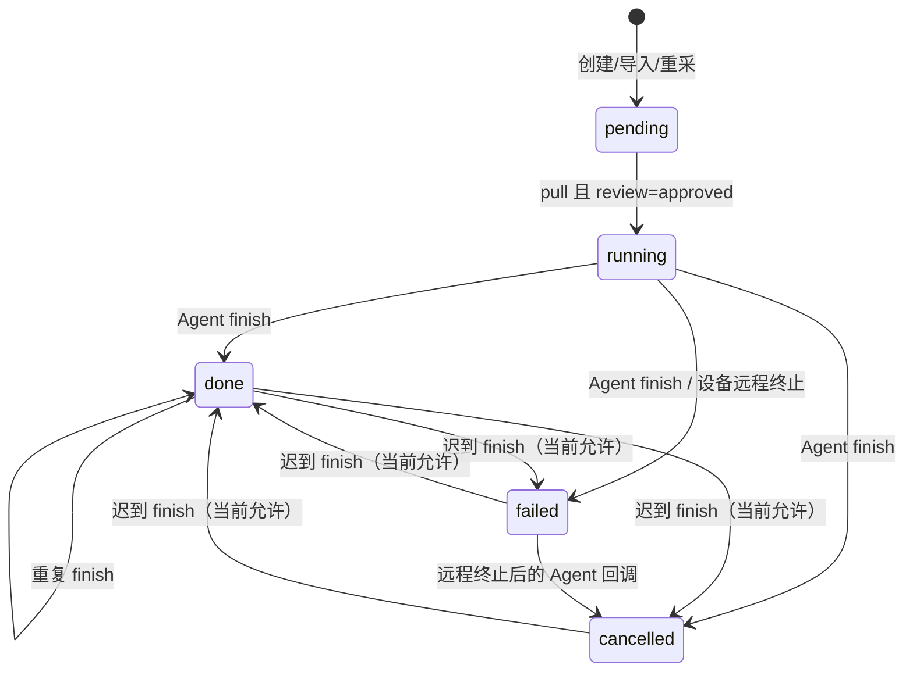
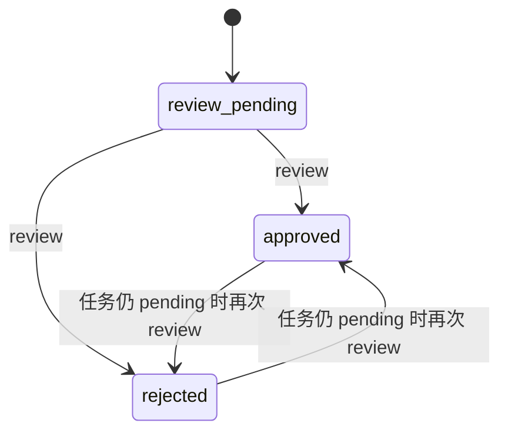
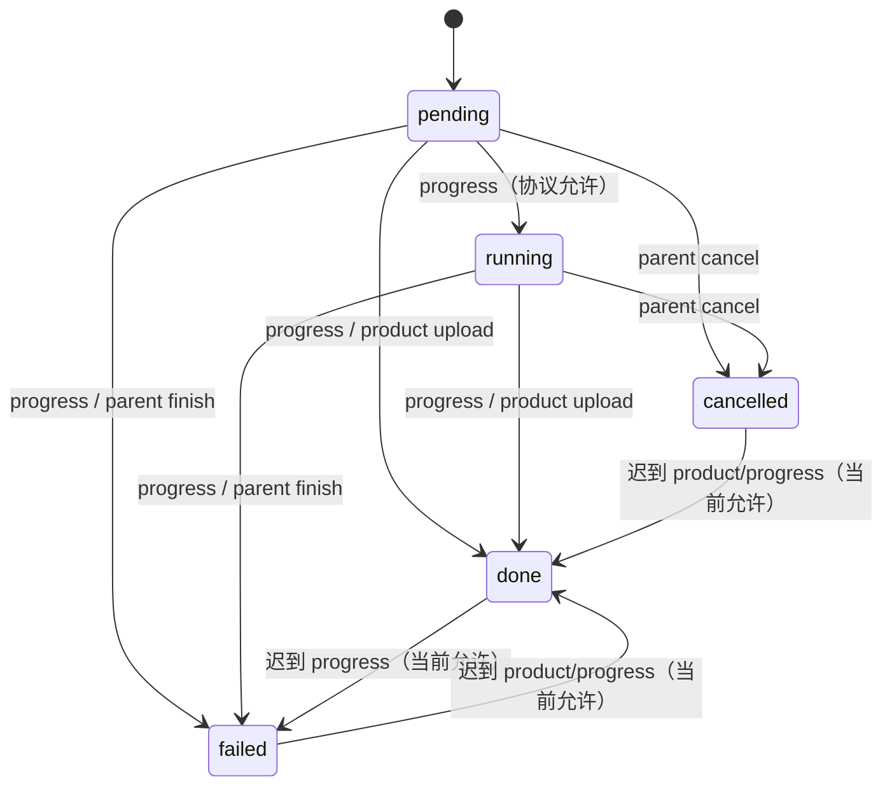
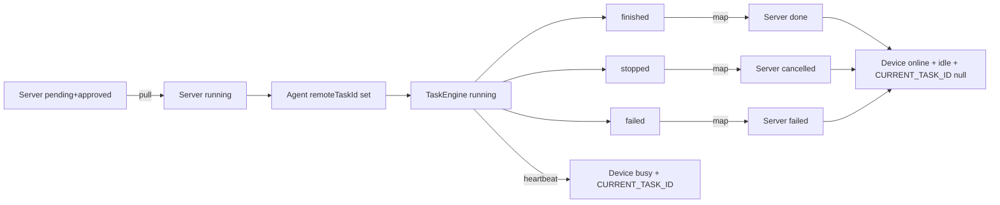
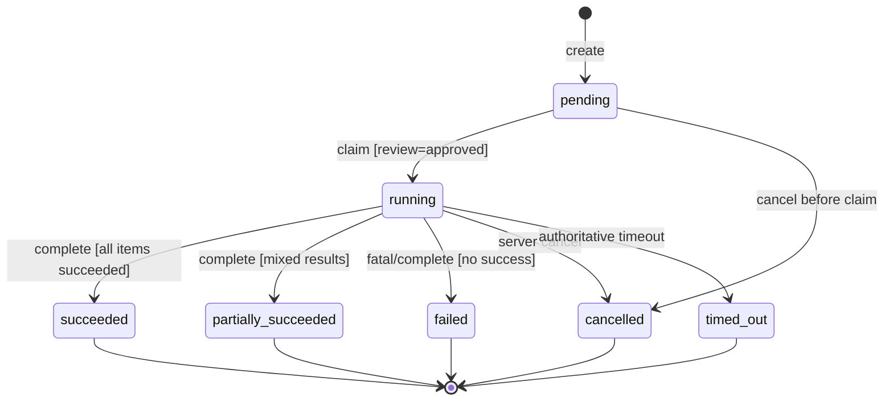

# T003：统一任务状态机——第一阶段分析

> 日期：2026-08-13  
> 分支：`task/T003-task-state-machine`（开始前已确认）  
> 阶段：仅分析与设计；未修改业务代码、数据库 schema 或采集逻辑  
> 对应 Backlog：BL-005；后续 BL-006/BL-007/BL-008/BL-106 以本模型为前置

## 0. 结论摘要与边界

当前系统没有单一任务状态机，而是至少八组相互关联但独立写入的状态：Oracle 任务、Oracle 任务项、任务审核、设备连接状态、设备运行状态、Android `TaskEngine`、Android `AgentCoordinator` 的远程任务引用、桌面任务及 Excel 行状态。状态值直接由 router、产品上传接口、Agent 回调、心跳、桌面线程和 SQLite DAO 写入。

核心问题不是枚举缺失，而是**服务端没有统一判定一次迁移是否仍合法**：`/progress` 和 `/finish` 不验证任务当前状态、任务归属设备或上报顺序；Android 可把未知本地结束状态映射为 `done`；心跳和结束请求均可修改设备占用；远程终止先把服务端任务置为 `failed`，随后 Agent 又会上报 `cancelled`。因此终态可被迟到请求覆盖，任务、任务项和 `CURRENT_TASK_ID` 可能失配。

本阶段推荐服务端任务权威状态集合为：

`pending -> running -> {succeeded, partially_succeeded, failed, cancelled, timed_out}`

任务项权威状态集合为：

`pending -> running -> {succeeded, not_matched, failed, cancelled}`

审核状态与执行状态保持正交：`pending -> {approved, rejected}`。设备连接态与运行态也保持正交。`paused` 暂不进入服务端权威任务枚举；在没有 lease/恢复协议前，它只属于本地执行控制态。`retry/requeue` 不把终态原记录倒退为 `pending`，而是创建新任务并保留来源关系；来源字段在当前 schema 中不存在，具体持久化方案标记为 **UNKNOWN**。

本设计暂不实现 lease、retry queue、schema 修改或采集逻辑修改。

## 1. 当前所有状态清单

### 1.1 服务端任务状态（`SJZQ_TASK.STATUS`）

| 状态 | 当前含义 | 修改者 | 当前转换入口 | 终态 | 重试 | 取消 | 重新排队 |
|---|---|---|---|---|---|---|---|
| `pending` | 已创建、尚未领取；是否可领取还取决于审核 `approved` | 创建/Excel 导入/失败项重采接口 | `POST /api/tasks`、Excel 导入、`/{id}/requeue-failed` | 否 | 不适用 | 当前无任务取消 API | 当前不原地重排 |
| `running` | 已由设备领取；并不证明 Agent 仍运行 | 服务端领取接口 | `POST /api/tasks/pull`，条件为当前 `pending` | 否 | 无 attempt 级重试 | 设备远程终止或 Agent `finish(cancelled)` | 当前没有 `running -> pending` |
| `done` | Agent 声明正常结束；UI 再依据成功/失败计数推导“全部成功/部分成功/全部失败” | Android 经 `/finish` | `POST /api/tasks/finish` | 当前被当作终态，但可被后续 `/finish` 覆盖 | 可对失败项创建新任务 | 代码仍允许迟到取消覆盖 | 失败项可复制成新任务 |
| `failed` | 执行异常，或设备远程终止（语义混用） | Android `/finish`；设备管理 API | `/api/tasks/finish`、`/api/devices/{id}/abort-task` | 当前被当作终态，但可被覆盖 | 失败项可复制成新任务 | 不应再取消，但当前可覆盖 | 是，复制失败项 |
| `cancelled` | Android 本地 `stopped`、远程终止后回调、或协调器清理残留远程任务 | Android `/finish` | `/api/tasks/finish` | 当前被当作终态，但可被覆盖 | 取消项默认可复制成新任务 | 已取消 | 是，默认包含取消项 |

补充事实：`TaskFinishIn.status` 是任意字符串；`/finish` 对未知值静默降级为 `done`。任务的“部分成功”目前不是持久化状态，只是 `_task_ui_status()` 根据 `done + success_count/fail_count` 推导的展示语义。

### 1.2 服务端任务项状态（`SJZQ_TASK_ITEM.STATUS`）

| 状态 | 当前含义 | 修改者 | 当前转换入口 | 终态 | 重试 | 取消 | 重新排队 |
|---|---|---|---|---|---|---|---|
| `pending` | 尚未完成匹配/采集 | 创建接口、Excel 导入、重采接口 | INSERT；旧 Android 商品匹配查询也只挑 `pending` | 否 | 是 | 是 | 否（新任务复制） |
| `running` | 协议允许上报，但当前 Android 未发现明确主动上报该值 | Agent `/progress` | `POST /api/tasks/progress` | 否 | UNKNOWN | 是 | 否 |
| `done` | 目标匹配成功/商品上传回填成功 | Agent `/progress`；商品上传接口 | `/progress(item_status=done)`；`/products/upload` | 是（但当前 SQL 可改写） | 通常否 | 否 | 否 |
| `failed` | 未匹配或处理失败；两类业务结果被混用 | Agent `/progress`；任务非取消结束时批量收口 | `/progress(item_status=failed)`；`/finish(done|failed)` 将剩余项改为 `failed` | 是（但当前可改写） | 是 | 否 | 是（复制到新任务） |
| `cancelled` | 任务取消时尚未完成 | `/finish(cancelled)` | 批量将 `pending/running` 改为 `cancelled` | 是（但当前可改写） | 可按策略重试 | 已取消 | 是（默认复制） |

当前没有 `not_matched`，所以“业务上正常搜索但未命中”和“技术执行失败”都落为 `failed`，导致重试策略和成功率口径无法区分。

### 1.3 审核状态（`SJZQ_TASK.REVIEW_STATUS`）

| 状态 | 当前含义 | 修改者 | 当前转换入口 | 终态 | 重试/重审 | 取消 | 重新排队 |
|---|---|---|---|---|---|---|---|
| `pending` | 待审核，任务仍保持执行态 `pending` | 创建/Excel 导入/重采 | INSERT 默认值 | 否 | 可审核 | 不适用 | 不适用 |
| `approved` | 允许被 `/pull` 领取；历史迁移数据默认视为已审核 | 审核人；迁移默认 | `POST /api/tasks/{id}/review` | 当前可再次改为 `rejected` | 当前允许反复审核，只要任务仍为 `pending` | 不适用 | 不适用 |
| `rejected` | 不允许领取，但任务执行态仍是 `pending` | 审核人 | 同上 | 当前可再次改为 `approved` | 当前允许 | 不适用 | 不适用 |

审核权限代码允许超级管理员或任务创建者本人审核；是否符合业务上的职责分离要求为 **UNKNOWN**。

### 1.4 Android `TaskEngine` 与 Room 任务状态

| 状态 | 含义 | 修改者/入口 | 终态 | 服务端当前映射 |
|---|---|---|---|---|
| `running` | 本地 Room 任务已创建且协程执行中 | `TaskEngine.runTask` 创建 `TaskEntity` | 否 | 间接对应 `running` |
| `finished` | 循环自然结束，即使内部存在失败项 | `TaskEngine` 正常结束 | 是 | `done` |
| `stopped` | `stopFlag` 或协程取消导致停止 | `stop()`、远程终止、更新 APK、本地停止 | 是 | `cancelled` |
| `failed` | 未处理异常导致失败 | `TaskEngine` catch | 是 | `failed` |

`TaskEngine.isRunning()` 只看 coroutine `job.isActive`，并不是持久化状态。Room 任务与远程任务没有持久化关联字段；App 重启后的远程任务恢复能力为 **UNKNOWN/当前未发现**。

### 1.5 Android `AgentCoordinator` 状态

`AgentCoordinator` 没有显式枚举，实际状态由三组变量组合产生：

| 组合状态 | 含义 | 修改者/入口 | 风险 |
|---|---|---|---|
| `remoteTaskId=null`, engine idle | 无远程任务，可拉取 | 协调循环、结束回调 | 正常空闲 |
| `remoteTaskId!=null`, engine running | 正在执行远程任务 | 拉取后先赋 ID，再启动 engine | 心跳映射设备 `busy/current_task_id` |
| `remoteTaskId!=null`, engine idle | 协调器认为存在“残留任务” | 启动失败、竞态或结束窗口 | 下一心跳主动上报 `cancelled`，可能覆盖服务端终态 |
| coordinator loop stopped | 只停止联网循环，不停止本地手动采集 | `AgentCoordinator.stop()` | “Agent 停止”和“任务停止”语义不同 |

未知本地结束字符串在映射 `when` 的 `else` 分支被当作服务端 `done`，属于 fail-open。

### 1.6 桌面采集任务状态

桌面运行控制枚举 `TaskState`：

| 状态 | 含义 | 修改者/入口 | 终态 | 重试/恢复 |
|---|---|---|---|---|
| `idle` | 当前线程不执行任务 | 初始化、线程 finally、早退 | 否（控制态） | 可启动新任务 |
| `running` | 桌面线程执行中 | start/resume | 否 | 可暂停/停止 |
| `pause` | 线程停在本地 pause event | pause | 否 | 可 resume 或 stop |
| `stop` | 已请求停止，线程可能尚未退出 | stop | 否（过渡控制态） | 线程退出后回 `idle` |

SQLite `task_log.status`：`running`、`finished`、`failed`、`stopped`、`interrupted`，查询兼容中还包含 `paused`。`paused` 没有发现对应持久化写入口，属于历史/预留状态。普通任务 stop 写 `stopped`；Excel stop、环境不可用和异常通常写 `interrupted`。桌面端是否接入服务端调度为 **UNKNOWN**，当前应保持独立状态域。

### 1.7 Excel 行任务状态（桌面 SQLite）

| 状态 | 当前含义 | 修改者/入口 | 终态 | 重试 | 取消 | 重新排队 |
|---|---|---|---|---|---|---|
| `pending` | 尚未处理 | checkpoint 创建；续跑时重置 `running` | 否 | 是 | 由父任务停止保留 | 续跑直接处理 |
| `running` | 当前行执行中 | 处理行前 | 否 | 崩溃恢复时改回 `pending` | 父任务可停止 | 是 |
| `hit` | 规格和准字命中 | 行处理成功匹配 | 是 | 否 | 否 | 否 |
| `miss` | 正常完成但未命中 | 行处理未匹配 | 是 | 当前续跑不含 `miss` | 否 | 当前否 |
| `error` | 行处理异常 | catch | 非稳定终态：续跑会再次处理 | 是 | 父任务可停止 | 是 |

这里的 `hit/miss/error` 同时编码业务结果与执行结果，无法直接一一映射服务端任务项的 `done/failed/cancelled`。

### 1.8 设备状态

设备存在两个状态字段及一个派生在线标志：

| 域 | 状态 | 含义 | 修改者/入口 | 终态 |
|---|---|---|---|---|
| `STATUS` | `online` | 心跳正常且未声明忙 | 注册、心跳、finish、abort | 否 |
| `STATUS` | `busy` | Agent 报告运行任务，或仅在投屏 | 心跳、pull | 否 |
| `STATUS` | `offline` | 心跳超时 | `mark_offline_stale` | 否 |
| `STATUS` | `error` | 设备异常；当前未发现任务路径主动设置入口 | UNKNOWN | 否 |
| `RUN_STATE` | `idle` | 无当前任务 | 心跳、finish、pull 预处理 | 否 |
| `RUN_STATE` | `running` | 有当前任务 | pull、心跳 | 否 |
| `RUN_STATE` | `resting` | 强制休息窗口 | pull/finish；当前开关关闭 | 否 |
| 派生 | `online: bool` | 心跳时效且 `STATUS` 非 offline/error | 查询时计算 | 不适用 |

`busy` 还可表示“仅投屏”，因此不能等价于“任务 running”。`CURRENT_TASK_ID` 是占用引用，不是状态，但参与核心不变量。

## 2. 当前状态迁移图

### 2.1 服务端任务及审核

### 2.2 任务项

### 2.3 Android、设备及桌面

桌面控制态当前为 `idle -> running <-> pause`，`running/pause -> stop -> idle`；持久化结果由普通任务映射为 `finished/stopped/failed`，Excel 任务映射为 `finished/interrupted`。

## 3. 冲突与风险

### 3.1 同一状态不同命名

- 服务端成功终态 `done`；Android 和桌面为 `finished`；Excel 行成功为 `hit`。
- 服务端取消 `cancelled`；Android 为 `stopped`；桌面普通任务为 `stopped`，Excel 为 `interrupted`。
- 桌面运行控制用 `pause/stop`，SQLite 查询兼容却使用 `paused/stopped`。
- 任务项 `done` 表示目标命中；任务 `done` 仅表示 Agent 正常结束，可能全部失败。

### 3.2 同名状态不同语义

- `running`：服务端表示已领取；Android Room 表示本地协程开始；桌面表示线程运行；设备 `RUN_STATE=running` 表示有 `CURRENT_TASK_ID`。
- `failed`：任务可指技术失败；任务项同时包含未命中；远程终止也把任务写成 `failed`。
- `busy`：可能是采集任务，也可能只是投屏。
- `pending`：任务可能待审核、审核拒绝后滞留，或已审核待领取；仅看执行状态无法区分。

### 3.3 非法迁移与终态覆盖

- `/finish` 无当前状态条件，可将任何任务（包括 `pending` 或任一终态）写成任一受支持终态。
- `/progress` 无任务必须为 `running` 的条件；任务终结后仍可更新任务项、计数与日志。
- 商品上传可把已失败/取消任务项改成 `done`，也可在任务终结后增加成功计数。
- 未知 finish 状态被静默当作 `done`；未知 Android 本地结束状态也被当作 `done`。
- review 更新缺少 compare-and-set 条件；读取 `pending` 后到 UPDATE 前任务可能已被领取。

### 3.4 状态更新竞争

- 远程终止：服务端先 `running -> failed` 并清设备；Agent 收到 abort 后 `TaskEngine -> stopped`，回调再 `failed -> cancelled`。
- `onTaskFinished` 先把 `remoteTaskId=null`，异步 finish 仍在网络中；协调循环可能立刻拉取下一任务，迟到完成与新任务心跳交错。
- `/progress` 的 item 回调、`/products/upload` 的 item 回填和 `/finish` 批量收口可并发写同一任务项。
- 普通任务成功计数由商品上传增量累加；任务项任务又按状态重算，重复上传和顺序差异会造成口径漂移。
- `pull` 以条件 UPDATE 避免同一任务被同时改写，但“SELECT 候选 -> UPDATE”没有显式锁；可避免双成功领取，却可能产生争抢、空取和设备状态更新顺序问题。多实例/高并发行为未有测试证据，标记 **UNKNOWN**。

### 3.5 Agent 状态覆盖服务端状态

- 协调器残留清理直接上报 `cancelled`，不先读取服务端权威状态。
- Agent finish 请求没有 attempt/version，服务端无法判断它属于当前执行还是旧执行。
- 服务端远程终止的语义没有随心跳命令返回权威任务终态，Agent 只能按本地 stop 推断。

### 3.6 任务与任务项不一致

- `done` 任务可能仍有 `failed` 项，并靠 UI 临时解释为“部分成功”；也可能所有项 `failed` 仍显示持久化 `done`。
- `/finish(done)` 会把剩余 `pending/running` 项改为 `failed`，说明 `done` 实际仅代表“执行结束”而非“全部成功”。
- `/devices/{id}/abort-task` 只更新任务，不批量收口任务项，可能留下 `pending/running` 项。
- 迟到进度可使终态任务重新出现非终态任务项。
- `SUCCESS_COUNT + FAIL_COUNT` 不包含 `cancelled`，也不保证等于目标数。

### 3.7 `CURRENT_TASK_ID` 不一致

- 设备 finish 按上报设备无条件清空 `CURRENT_TASK_ID`，没有要求其值等于 `body.task_id`；旧任务迟到 finish 可能清除新任务占用。
- 心跳只验证任务状态是 `running`，没有验证该任务分配给本设备；理论上可把其他设备的任务 ID 绑定到当前设备。
- 设备离线只改 `STATUS=offline`，不结束、取消或重排 `running` 任务，也不清 `CURRENT_TASK_ID`；这是 lease 阶段才可确定处理的悬挂态。
- `mark_offline_stale` 只在设备列表查询时触发，当前不是独立 reconciliation。
- abort 清除 `STATUS` 和 `CURRENT_TASK_ID`，但未同步 `RUN_STATE`，可形成 `online + RUN_STATE=running + CURRENT_TASK_ID=null`。

### 3.8 暂停、取消、失败、部分成功语义不明确

- 暂停只有桌面内存控制态，没有服务端协议，也没有可靠持久化恢复边界。
- 取消既可能是用户主动取消、远程管理终止、更新 APK 前停止、协调器清理孤儿，也可能是协程取消；原因没有结构化区分。
- 失败同时覆盖技术异常、业务未命中和管理员终止。
- 部分成功只是展示推导，没有稳定 API 枚举；不同消费者可能对 `done` 作出不同解释。
- 超时没有权威状态或入口；离线、卡死、慢任务无法区分。超时阈值与处置策略为 **UNKNOWN**。

## 4. 推荐服务端权威状态模型

### 4.1 设计原则

1. Oracle 任务与任务项状态是执行结果的唯一权威；客户端只报告事件/本地观察，不直接决定任意迁移。
2. 审核、连接、设备运行和执行结果分属不同状态域，不复用同一枚举。
3. 状态单调前进；终态不可被客户端请求改写。
4. 任务最终结果由任务项聚合与执行结束原因共同判定，Agent 不直接上报“部分成功”。
5. 所有迁移经单一服务函数校验，并使用条件 UPDATE/CAS；router 和客户端不得散写状态。
6. `retry/requeue` 创建新任务/新执行关系，不使历史终态倒退。
7. 本阶段只定义模型；attempt、lease、超时回收和幂等序号后续实现。

### 4.2 推荐任务状态

| 状态 | 定义 | 终态 | 可取消 | 可重试 | 可重新排队 |
|---|---|---:|---:|---:|---:|
| `pending` | 已创建，尚未开始执行；是否可领取由审核态决定 | 否 | 是 | 不适用 | 已在队列 |
| `running` | 服务端已授予执行权，任务正在或应当执行 | 否 | 是 | 失败后按策略 | 否 |
| `succeeded` | 执行结束，所有应处理项均成功/命中，且无失败/取消项 | 是 | 否 | 否 | 否 |
| `partially_succeeded` | 执行结束，至少一个项成功，且至少一个项为未命中/失败/取消 | 是 | 否 | 可只重采非成功项 | 通过创建新任务 |
| `failed` | 执行因技术/业务不可完成而结束，且没有成功项，或发生任务级致命错误 | 是 | 否 | 取决于错误分类 | 通过创建新任务 |
| `cancelled` | 服务端已接受取消，执行结果不再接受；未完成项统一收口取消 | 是 | 否 | 可人工新建重采 | 通过创建新任务 |
| `timed_out` | 服务端认定执行超过约定时限/租约，当前 attempt 失效 | 是 | 否 | 通常可，取决于次数/错误 | 通过新 attempt 或新任务；最终方案待 BL-006 |

`pending` 同时容纳待审核与审核后排队，但 API 必须同时返回 `review_status` 和派生 `dispatchable`，禁止仅凭 `pending` 显示“可执行”。是否需要独立 `cancel_requested` 中间态取决于取消握手时限，当前标记 **UNKNOWN**；在未实现该字段前，建议服务端接受取消即置 `cancelled`，后续 Agent 上报只记录审计、不改终态。

### 4.3 推荐任务项状态

| 状态 | 定义 | 终态 | 可重试/重排 |
|---|---|---:|---|
| `pending` | 尚未开始 | 否 | 是 |
| `running` | 当前执行到该项 | 否 | 是 |
| `succeeded` | 已产出满足目标的结果 | 是 | 否 |
| `not_matched` | 正常执行完成，但没有满足目标的数据 | 是 | 是否重采由业务策略决定 |
| `failed` | 技术或数据处理失败 | 是 | 由 `retryable` 决定；错误分类在 BL-106 |
| `cancelled` | 父任务取消/超时收口，未完成 | 是 | 可新任务重采 |

普通多商品采集是否每个关键词都应生成并聚合任务项，当前业务模型为 **UNKNOWN**。在确认前，不强行用商品条数替代任务项成功数。

### 4.4 推荐审核状态

`pending -> approved` 或 `pending -> rejected`。`approved/rejected` 均视为一次审核终态；若需要改审，使用显式 `reopen_review` 管理操作并记录审计，而不是重复调用同一 review 接口。被拒绝任务保持执行态 `pending` 仅为兼容现 schema，派生状态应显示“审核拒绝”，且不可领取。是否允许创建者自审为 **UNKNOWN**。

### 4.5 推荐设备状态域

- 连接态：`online | offline | error`，只描述心跳/可通信性。
- 运行态：`idle | running | resting`，只描述任务执行占用；投屏不得写成 `running`。
- 投屏态继续留在 cast 子系统，不复用任务状态。
- 不变量：`run_state=running <=> current_task_id 指向该设备拥有的非终态 running 任务`；连接态 `offline` 可以暂时与 `run_state=running` 共存，直到 lease/reconciliation 作出权威处置。

### 4.6 推荐权威迁移图

## 5. 推荐状态迁移表

| 当前状态 | 事件 | 前置条件 | 下一状态 | 项目收口 | 设备收口 | 非法情况处理 |
|---|---|---|---|---|---|---|
| 无 | `create` | 输入合法 | `pending` | 建立 `pending` 项 | 无 | 拒绝 |
| `pending` | `approve` | review=`pending` | `pending` | 不变 | 无 | 冲突/重复返回幂等结果 |
| `pending` | `reject` | review=`pending` | `pending` | 不变 | 无 | 同上 |
| `pending` | `claim` | review=`approved`；设备空闲；条件更新成功 | `running` | 保持 `pending` | 绑定设备并置 running | 返回冲突/无任务 |
| `pending` | `cancel` | 未领取 | `cancelled` | 所有 `pending -> cancelled` | 无 | 终态重复取消幂等 |
| `running` | `item_start` | 项为 `pending` 且属于当前任务 | `running` | 目标项 `running` | 不变 | 拒绝旧/终态项 |
| `running` | `item_succeed` | 项为 `pending/running` | `running` | 目标项 `succeeded` | 不变 | 终态重复同结果幂等；不同结果冲突 |
| `running` | `item_not_matched` | 项为 `pending/running` | `running` | 目标项 `not_matched` | 不变 | 同上 |
| `running` | `item_fail` | 项为 `pending/running` | `running` | 目标项 `failed` | 不变 | 同上 |
| `running` | `complete` | 当前执行权有效；所有项已终结或按规则收口 | 聚合为三种完成结果 | 未决项按明确结束原因收口 | 仅当 `CURRENT_TASK_ID` 相等才清除 | 拒绝迟到/错误设备请求 |
| `running` | `cancel` | 权威管理请求 | `cancelled` | 未终结项 `cancelled` | 条件清除并下发停止命令 | Agent 后续 finish 只记审计 |
| `running` | `timeout` | 服务端时钟/lease 判定 | `timed_out` | 未终结项 `cancelled` 或独立 `timed_out`：**UNKNOWN，需业务确认** | 条件清除 | 旧上报拒绝 |
| 任一终态 | 任一状态变更事件 | 无 | 不变 | 不变 | 不得影响新任务占用 | 同结果幂等；不同结果返回冲突并审计 |

### 5.1 结果聚合规则

- 全部应处理项为 `succeeded`：任务 `succeeded`。
- 至少一个 `succeeded`，且存在 `not_matched/failed/cancelled`：`partially_succeeded`。
- 无 `succeeded` 且正常执行后全为 `not_matched`：归 `failed` 还是单独增加 `not_matched` 任务终态，业务语义为 **UNKNOWN**；本设计暂归 `failed`，但要求保存结束原因 `NO_MATCH`。
- 无成功且存在任务级致命错误：`failed`。
- 服务端取消优先：`cancelled`；服务端超时优先：`timed_out`。
- `success_count/fail_count` 应为任务项聚合投影，不是独立权威状态。`not_matched_count/cancelled_count` 当前无字段，数据库表达方式为 **UNKNOWN**。

## 6. Android 映射

| Android 本地状态/事件 | 服务端权威含义 | 推荐上报行为 |
|---|---|---|
| engine `running` | 仅本地执行观察；服务端应已为 `running` | 心跳/进度，不重新决定任务状态 |
| target matched | item `succeeded` | 上报明确 item 结果；重复同结果幂等 |
| target not matched | item `not_matched` | 不再映射为技术 `failed` |
| engine `finished` | “执行已结束”，不是直接 `succeeded` | 发送 `complete` 事件；服务端聚合项目结果 |
| engine `failed` | 任务级失败候选 | 上报 `fail` + 结构化原因；服务端验证执行权后迁移 |
| engine `stopped`（收到服务端取消） | 服务端已是 `cancelled` | ACK/日志，不覆盖终态 |
| engine `stopped`（本地用户停止） | 请求取消 | 发送 cancel 请求；服务端决定迁移 |
| coroutine cancellation（生命周期/更新） | 原因不确定 | 禁止直接映射成功；上报明确原因，未知则失败关闭（fail-closed） |
| `remoteTaskId!=null && engine idle` | 客户端不确定态 | 查询服务端任务状态；禁止无条件上报 `cancelled` |
| 未知本地状态字符串 | 协议错误 | 拒绝映射并记录错误，禁止默认 `done` |

`remoteTaskId` 仅为运行时引用，不能作为权威状态。后续 BL-006/008 应使用持久化 `attempt_id/outbox` 恢复；本阶段不实现。

## 7. 桌面端映射

旧桌面端当前与服务端数据库隔离，推荐先保持隔离边界：

| 桌面状态 | 若未来接入服务端的映射 | 当前处理 |
|---|---|---|
| 控制态 `idle` | 无正在执行的本地任务 | 不上报任务终态 |
| 控制态 `running` | server `running` 的本地观察 | 保持本地 |
| 控制态 `pause` / SQLite `paused` | 本地暂停，不改变服务端权威任务状态 | 保持本地；是否引入服务端 paused 为 **UNKNOWN** |
| 控制态 `stop` | 取消请求中 | 不作为持久化终态 |
| SQLite `finished` | 发送 complete，由服务端聚合 | 当前保持本地 |
| SQLite `stopped` | 本地主动停止；映射取消请求 | 当前保持本地 |
| SQLite `interrupted` | 可恢复的执行中断；不能等价于 cancelled/failed | 当前保持本地；未来映射 attempt 中断而非任务终态 |
| SQLite `failed` | 失败候选 | 当前保持本地 |
| Excel 行 `hit` | item `succeeded` | 当前保持本地 |
| Excel 行 `miss` | item `not_matched` | 当前保持本地 |
| Excel 行 `error` | item `failed`，且可重试属性另存 | 当前保持本地 |

桌面任务是否成为正式服务端 Agent、是否要求断点与 Oracle 双写、以及历史 SQLite 迁移范围均为 **UNKNOWN**。在决策前不得把两套 ID 或状态直接混用。

## 8. 数据库影响

### 8.1 本阶段

不修改 schema，不迁移数据。本文仅定义目标枚举、迁移和不变量。

### 8.2 后续实现的最小影响

- `SJZQ_TASK.STATUS`：新值需要兼容现有 `pending/running/done/failed/cancelled`。建议先兼容读写，再分阶段把 `done` 映射/迁移为 `succeeded/partially_succeeded`；历史 `done` 若缺少可靠项数据，只能标记 **UNKNOWN** 或按可证明计数推导。
- `SJZQ_TASK_ITEM.STATUS`：`done -> succeeded`；原 `failed` 无法可靠拆成 `not_matched/failed`，历史语义为 **UNKNOWN**。
- `REVIEW_STATUS`：值可保留，迁移逻辑需要 CAS 与审计。
- `SJZQ_DEVICE.STATUS/RUN_STATE/CURRENT_TASK_ID`：字段可暂保留，写入必须进入同一事务并增加一致性条件。
- 推荐新增状态变更版本/事件、结束原因、来源任务关系及 attempt 字段，但这属于 BL-006/007 与 schema 任务，具体列设计本阶段 **UNKNOWN**。
- 当前 schema 没有 CHECK 约束；是否以 DB CHECK、应用枚举或两者共同约束，需结合 BL-004 的 Oracle 版本基线决定。

### 8.3 数据不变量

1. 任务终态不可回到非终态，也不可切换为另一终态。
2. 一个 `running` 任务至多对应一个设备的 `CURRENT_TASK_ID`。
3. 设备 `CURRENT_TASK_ID=T` 时，T 必须存在、为 `running` 且 `T.DEVICE_ID=DEVICE_ID`。
4. 清除设备占用必须带 `WHERE CURRENT_TASK_ID=:task_id`，迟到完成不得清除新任务。
5. 任务计数由权威任务项/去重结果派生，不能由重复 delta 无限制累加。
6. 审核非 `approved` 的任务不可进入 `running`。
7. 任务终结后不接受改变结果的 item/product/progress 写入；只允许幂等重复或审计日志。

## 9. API 影响

### 9.1 推荐契约变化

- 响应同时返回 `status`、`review_status`、`terminal`、`dispatchable`、`can_cancel`、`can_retry`，Web 不再猜测。
- `/pull` 只触发服务端 `claim` 迁移，并返回权威状态；并发失败返回明确冲突/无任务。
- `/progress` 拆分或明确事件类型：item start/succeeded/not_matched/failed；禁止任意状态字符串。
- `/finish` 改为“执行完成事件”，不接受客户端直接指定任意任务终态；服务端聚合决定结果。
- 新增显式任务 cancel 入口；设备 abort 调用同一任务取消服务，不再直接 SQL 写 `failed`。
- `requeue-failed` 保持“创建新任务”语义，响应应返回 source/new task 关系；只选择允许重试的项。
- review 使用明确枚举与条件更新；重复同决策幂等，不同决策返回冲突或走显式改审。
- 非法迁移返回稳定错误码（如 `TASK_STATE_CONFLICT`、`TASK_TERMINAL`、`TASK_DEVICE_MISMATCH`），HTTP 状态与现有 `ApiOk(ok=false)` 的兼容策略为 **UNKNOWN**。

### 9.2 向后兼容

- 旧 Android `finished -> done` 可在兼容层解释为 complete 事件，而数据库逐步写新状态。
- 旧 `stopped -> cancelled` 仅在任务仍 `running` 且设备匹配时接受；若服务端已终态，返回幂等结果。
- 旧 item `done/failed` 在兼容窗口映射为 `succeeded/failed`；无法识别 `not_matched`，因此旧 Agent 的失败分类保持低精度。
- 未知状态不能再静默成功；兼容窗口内应返回明确协议错误并记录 Agent 版本。
- Web 过渡期同时认识旧、新状态，展示逻辑优先使用服务端派生字段。

## 10. 测试方案

### 10.1 纯状态机单元测试

- 覆盖任务、任务项、审核的每一条合法迁移。
- 对所有状态笛卡尔积验证非法迁移被拒绝。
- 验证终态不可改写、重复同事件幂等。
- 验证聚合规则：全成功、混合、全未命中、全失败、取消、超时、零任务项。
- 验证 Android/桌面旧状态映射，未知值必须失败关闭。

### 10.2 服务/数据库集成测试

- 创建→审核→领取→item 结果→完成的完整事务。
- 审核与领取并发；两个设备并发领取；同一设备并发拉取。
- finish 与 progress/product upload 并发，终态保持单调。
- 远程取消与 Agent finished/stopped/failed 交错到达。
- 旧任务迟到 finish 不得清除设备的新 `CURRENT_TASK_ID`。
- 心跳携带不存在、已终态、他设备所有的 task ID 时拒绝绑定。
- 任务、任务项、计数、设备不变量巡检测试。
- Oracle 测试 schema 当前不可用，实际集成执行条件为 **UNKNOWN/BLOCKED_BY_ENVIRONMENT**（沿用 T001/T002 结论）。

### 10.3 Android 测试

- `TaskEngine` 的 finished/stopped/failed 与每种停止原因。
- `AgentCoordinator` 结束回调、心跳和拉取的顺序测试。
- 网络失败后不得把未知状态当成功；残留 `remoteTaskId` 先查询服务端。
- 远程 abort、APK 更新、本地停止分别产生不同原因。
- App 重启恢复需等 BL-008 outbox/Room migration 后验证。

### 10.4 桌面与 Excel 测试

- `idle/running/pause/stop` 控制迁移。
- `running` Excel 行崩溃后只重置该行，`hit/miss` 不回退。
- `error` 重试、停止和恢复时父任务结果可确定。
- 若未来接入服务端，增加映射契约测试；目前只测隔离不串写。

### 10.5 API/Web 契约测试

- 枚举、派生能力字段、稳定错误码和旧 Agent 兼容。
- Web 对 rejected pending、partial success、cancelled、timed_out、设备离线但运行未回收等组合显示准确。

## 11. 实施步骤

1. 负责人确认本文中的 **UNKNOWN** 业务决策：全未命中任务结果、暂停是否服务端化、取消握手、超时阈值、桌面端定位、自审规则。
2. 在服务端建立纯函数枚举、迁移表、聚合规则与单元测试；不接数据库。
3. 建立单一任务状态服务，先包裹现有 SQL 并增加 CAS/设备匹配/终态保护，不做大型 router 重构。
4. 让 cancel、abort、finish、progress、product upload 统一调用状态服务；删除直接状态写入。
5. 增加 API 派生字段和稳定冲突响应，同时保留旧 Agent 映射层。
6. 升级 Android 映射：complete 事件、明确停止原因、未知状态失败关闭；暂不引入 outbox。
7. Web 改用权威/派生字段；保留旧状态展示兼容。
8. 在 BL-004 测试 schema 基线完成后设计并执行状态数据迁移；历史歧义值保留审计标记。
9. 增加 Oracle 集成、模拟 Agent E2E 和并发/乱序测试。
10. 状态机稳定后再进入 BL-006 lease/attempt、BL-007 幂等、BL-008 outbox 和 BL-106 错误重试。

## 12. 风险和兼容方案

| 风险 | 影响 | 兼容/缓解方案 |
|---|---|---|
| 新旧 Agent 同时在线 | 旧枚举精度不足、迟到请求 | 服务端版本感知兼容层；终态/CAS 规则对所有版本强制 |
| `done` 历史数据语义不明 | 无法可靠迁移为成功或部分成功 | 只在任务项和计数可证明时推导，否则标记 UNKNOWN/保留旧值读取 |
| `failed` 项混合未命中与异常 | 重试过多或漏重试 | 新数据分开写；历史失败默认需人工/保守策略 |
| 状态收敛改变现有 UI 统计 | 报表跳变 | 新旧字段双读对比，先增加派生字段再切换展示 |
| 严格终态保护暴露旧 Agent 乱序 | 上报出现冲突 | 同结果幂等；冲突记录日志和版本，不改权威状态 |
| 取消立即终态但 Agent 尚在运行 | 仍产生迟到商品/进度 | 服务端拒绝结果变更；停止命令继续下发；未来 attempt 隔离 |
| 暂无 lease | running 任务仍可能永久卡住 | 本阶段明确不伪造自动回收；人工处置并记录，BL-006 实现权威超时 |
| 设备 `busy` 同时表示投屏 | UI/调度误判 | 拆分连接/运行/投屏派生，调度只看 `RUN_STATE` 与权威任务 |
| 桌面端去留不明 | 强行统一导致双写/ID 冲突 | 当前只定义映射，保持 SQLite 隔离 |
| Oracle schema 前置未完成 | 无法安全加约束/迁移历史数据 | 先纯函数与兼容服务；写入式迁移等待 BL-004/BL-010 |

## 13. 第一阶段停止点

已完成现状清单、当前迁移图、冲突风险、服务端权威模型、迁移表、Android/桌面映射、数据库/API 影响、测试方案、实施步骤与兼容方案。本阶段到此停止；未实现 lease、retry queue，未修改数据库 schema、业务代码或采集逻辑。
