# Phase 1「核心链路可靠」验收报告

> 验收日期：2026-08-17
> 分支：`codex/phase1-core-reliable`
> 结论：**PASS**。Phase 1 的 12 项验收条件全部满足，P0 全部关闭；按约束停止，不进入 Phase 2。

## 1. 完成任务

### T004：固定 fixture 与成功门禁

- 建立 10 类合法脱敏离线样本：正常商品、登录、验证、繁忙、下架、不存在、缺价格、缺 SKU、缺销量、结构异常。
- 统一并持久化 `parse_status`、`page_status`、`quality_status`、`field_sources`、`parser_version`、`quality_rules_version`。
- Android `ProductQualityGate` 与服务端 `product_quality.py` 双重校验；异常页、缺商品身份、缺正价格均不会产生可上传商品。
- SKU/销量等可选字段缺失保留为 warning/null，不以 0 伪造。

### T005：修复 Android 假完成

- Room v2 新增持久 `upload_outbox`，商品与 product outbox 同事务写入。
- pull 到 TaskEngine 之间的任务分配先同步写入 SharedPreferences，Room 接管或 finish ack 后再清理。
- product/image/finish 使用稳定 idempotency key、持久 retry、指数退避、明确 acknowledgement。
- 网络、5xx、无效 JSON、缺 ack、图片失败、finish 失败均不会把任务标为 Complete。
- 服务端新增 `SJZQ_UPLOAD_RECEIPT`；同 key 同 payload 返回原始 ack，同 key 不同 payload 拒绝。
- receipt replay 先于当前质量规则，规则升级不会破坏历史请求的幂等确认。
- 同 Task + platform + item_id 即使使用不同请求 key 也只形成一条业务商品。
- finish manifest 必须与已确认 product/image receipts 一致，服务端事务提交终态后 Agent 才清除远程任务。
- 远程图片允许 `SOURCE_URL` 存在而 `REL_PATH` 为空；本地 multipart 图片仍必须有实际相对路径。

### T006：统一测试基线

统一入口：

```powershell
.\scripts\test-baseline.ps1 -Strict
```

固定环境：Python 3.10、Node 22.18、JDK 17.0.20、Gradle 8.4、Android SDK/Build Tools 34、Oracle 19c 专用测试 Schema。

### 数据契约

`docs/decisions/phase1-success-data-contract.md` 已定义：

- Product、ProductSnapshot、CollectionTask、CollectionJob、CollectionAttempt；
- 商品身份 `(platform, item_id)`；
- Snapshot identity、采集事实和创建条件；
- idempotency key、重复请求、失败和 Task Complete 不变量；
- 本阶段不执行 Product/ProductSnapshot 大规模迁移。

## 2. 修改模块

| 层 | 主要模块 |
|---|---|
| Android 执行/协调 | `TaskEngine.kt`、`AgentCoordinator.kt`、`ServerPrefs.kt` |
| Android 网络 | `ApiClient.kt`、`OutboxRetryPolicy.kt` |
| Android 数据 | `AppDatabase.kt`、`Dao.kt`、`Entities.kt`、`OutboxPayload.kt` |
| Android 解析/质量 | `DetailReader.kt`、`ProductQualityGate.kt` |
| 服务端上传/完成 | `server/routers/products.py`、`server/routers/tasks.py` |
| 服务端数据契约 | `server/schemas.py`、`server/product_quality.py` |
| Oracle Schema | `server/init_schema.py`、`server/migrate.py` |
| 测试工具链 | `scripts/test-baseline.ps1` 及 bootstrap/inspect/python runner |
| 测试 | Python fixture/contract/quality/Oracle；Android Room/MockWebServer/fixture/quality |
| 文档 | ADR、architecture、GAP、backlog、T004/T005/T006 文档 |

## 3. 架构变化

```mermaid
flowchart LR
    Task["Task 创建并审核"] --> Pull["Agent pull + 持久任务分配"]
    Pull --> Search["搜索与详情页"]
    Search --> Page["page_status 分类"]
    Page --> Gate["Parser + Quality Gate"]
    Gate -->|拒绝| Failure["明确失败/隔离，不生成伪商品"]
    Gate -->|通过| RoomTx["Room Product + Outbox 原子事务"]
    RoomTx --> Retry["持久 Retry / 重启恢复"]
    Retry --> Upload["Product/Image stable key"]
    Upload --> OracleTx["Oracle 数据 + Receipt 原子提交"]
    OracleTx --> Ack["persisted + acknowledged"]
    Ack --> Manifest["Finish manifest"]
    Manifest --> Confirm["服务端核对 receipts 并提交终态"]
    Confirm --> Complete["Agent 收到 finish ack 后 Task Complete"]
```



成功不变量：

```text
Task Complete
= 所有预期商品/图片已获得服务端 receipt
+ finish manifest 与 receipts 一致
+ Oracle 终态事务已提交
+ Agent 收到 finish acknowledgement
```

## 4. 测试结果

| 套件 | 实际结果 |
|---|---|
| Python 离线/协议/质量/状态 | 60/60 PASS |
| Oracle 真实多连接/事务 | 8/8 PASS，Oracle 19c |
| Android JVM | 36/36 PASS |
| Web production build | PASS，1665 modules transformed |
| 统一严格入口 | `PASS=4 FAIL=0 BLOCKED=0`，exit 0 |
| `git diff --check` | exit 0 |
| Python compileall | exit 0 |
| Oracle 测试残留检查 | Device=0、Task=0、OpLog=0、UploadReceipt=0 |
| 回滚副本验证 | 19 个原文件哈希一致；基线 44 tests PASS |

Oracle 8 项覆盖：并发 pull、Complete/Cancel 20 轮竞态、progress receipt 竞争、商品事务回滚、相同 key 并发、不同 key 业务去重、finish manifest 拒绝以及最小成功闭环。

最小成功闭环已真实执行：

```text
Task create → review → pull → strict product upload
→ Oracle product/receipt persisted → finish manifest
→ finish receipt → Task succeeded → device released
```

## 5. 逐项验收

| # | 条件 | 状态 | 证据 |
|---:|---|---|---|
| 1 | 正常 fixture 稳定解析 | PASS | Python fixture replay + Android fixture replay |
| 2 | 登录/验证/下架/不存在等不生成伪商品 | PASS | 10 类 fixture、双重质量门禁 |
| 3 | 商品上传失败不导致 Complete | PASS | MockWebServer failure tests + Oracle finish manifest |
| 4 | 重复请求不产生重复业务数据 | PASS | Oracle same-key concurrency 与 different-key business dedup |
| 5 | Agent/网络异常无静默数据丢失 | PASS | Room 原子 outbox、reopen、retry、pending assignment durability |
| 6 | Python 基础测试 | PASS | 60/60 |
| 7 | Oracle integration 实际执行 | PASS | 8/8 |
| 8 | Android JVM 实际执行 | PASS | 36/36 |
| 9 | Web build | PASS | 1665 modules |
| 10 | 统一测试入口 | PASS | `scripts/test-baseline.ps1 -Strict` exit 0 |
| 11 | 成功语义与数据契约文档 | PASS | Phase 1 ADR |
| 12 | P0 全部关闭或明确阻塞 | PASS | P0 全部关闭，无外部阻塞 |

## 6. P0/P1 GAP 变化

### P0

- 上传失败假完成：CLOSED。
- 异常页/缺价格伪商品：CLOSED。
- 完整运行基线未验证：CLOSED。
- 最终只读 Code Review：未发现确定 P0。

### P1

已关闭：

- product/image/finish 缺幂等与确认；
- App/Agent 重启丢未确认上报；
- 同任务商品重复写入；
- 图片数量截断与 ack 数量不一致；
- receipt replay 被新质量规则拒绝；
- 远程图片 `REL_PATH NOT NULL` 与 Oracle 空字符串语义冲突。

保留到后续阶段：

- App 被系统杀死后的无人值守唤醒；
- 任务 lease、checkpoint、超时回收和跨设备 reclaim；
- 文件系统图片写入与 Oracle 事务之间的孤儿文件回收；
- Product/ProductSnapshot 正式模型与历史差异分析。

## 7. 尚未解决问题与技术债务

1. Outbox 恢复由 App/Agent 下次启动触发；后台唤醒需要 WorkManager 或前台服务。
2. 图片文件和 Oracle 元数据不是同一介质事务，需要临时文件/rename 或孤儿扫描。
3. Oracle 迁移仍是幂等启动补丁，尚未形成带版本、checksum、互斥锁的迁移框架。
4. Android 真实设备上的长时间运行、登录失效、验证码和弱网 soak test 尚未形成自动化实验室。
5. 正式 ProductSnapshot、企业/workspace 隔离和多平台 Collector 抽象均按 Roadmap 延后。

## 8. Phase 2 启动条件

**具备启动条件。** Phase 1 的核心可靠闭环、测试入口和服务端确认语义已稳定；Phase 2 可以在这些不变量上实现任务租约、checkpoint、暂停/恢复和后台调度。

Phase 2 开始前仍需项目负责人批准，本报告不自动启动 Phase 2。

## 9. Phase 2 推荐执行计划

1. 定义 `CollectionJob/CollectionAttempt` 最小运行模型及 lease/heartbeat/reclaim ADR。
2. 增加任务暂停、恢复、checkpoint 和幂等状态迁移。
3. 使用 WorkManager/前台服务驱动 outbox 与任务恢复，覆盖进程被杀和设备重启。
4. 建立网络故障、Agent 重启、服务重启及 lease 超时的真实集成测试矩阵。
5. 增加 reconciliation：以服务端 receipt/manifest 为准修复客户端与服务端状态漂移。

依赖顺序：`Attempt/lease contract → server state/storage → Android recovery driver → reconciliation → fault-injection acceptance`。
