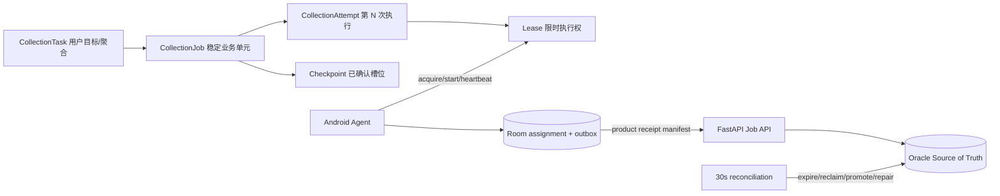

# Phase 2 任务系统稳定：验收报告

- 日期：2026-08-17
- 结论：**Phase 2 验收通过；停止进入 Phase 3，等待批准。**
- ADR：[`../decisions/phase2-job-attempt-lease.md`](../decisions/phase2-job-attempt-lease.md)
- 范围：FastAPI / Oracle / Android Agent；未引入 Enterprise、ProductSnapshot、其他平台或管理端重构。

## 1. 完成任务与架构变化



完成内容：

1. `CollectionTask / CollectionJob / CollectionAttempt / Lease / Checkpoint / Outbox` 职责、状态与事务边界形成正式 ADR。
2. Oracle 以新增表实现 Job、Attempt、Lease、Checkpoint、服务端 Outbox、Job Event；Task 增加 pause/deadline，Device 增加 active pointers。
3. acquire 使用 `FOR UPDATE SKIP LOCKED`、Device/Task/Job 行锁及 function-based unique fence；同一 Job 同时只有一个 active Attempt。
4. 所有 Worker 写入验证 `(job_id, attempt_id, worker_id, device_id, lease_token)` 和数据库时间；bearer token 不落库，只存 SHA-256。
5. heartbeat 延长 Lease；过期 Lease 由 reconciliation reclaim，旧 Worker 的商品、图片、checkpoint、complete 均被拒绝。
6. Pause 阻止新分配；运行 Job 在安全点提交 checkpoint 后 yield；Resume 把 paused Job 恢复为 pending。
7. Retry 按 transient/permanent/business rejection/data quality/auth/manual 分类，transient 使用有上限的指数退避；`retry_wait` 只能由 reconciliation 转 pending。
8. Android Room v3 保存 assignment 与 lease-bound outbox；App/Agent 启动先 recover，对账成功后恢复；WorkManager、Foreground Service、Boot Receiver 和网络约束承担允许范围内的唤醒。
9. 商品 ACK 后写 `confirmed_slots` checkpoint；App/Attempt 恢复时从服务端 checkpoint 和本地 ACK outbox 合并，跳过已确认槽位。
10. 多商品 Job 提交完整 receipt manifest；服务端逐项核验并选择 TaskItem canonical receipt。零确认结果、任一永久拒绝都转 Job failure。
11. 周期和手动 reconciliation 覆盖过期 Lease、Task/Job 终态冲突、成功缺结果、结果存在但 Job 未成功、重复 Attempt、无效 Lease、设备孤儿指针、due retry 与 stale server outbox。

## 2. 状态机与数据库

Job 正式状态机：

```text
pending    -> leased | paused | cancelled
leased     -> running | retry_wait | paused | failed | cancelled | dead
running    -> success | retry_wait | paused | failed | cancelled | quarantined | dead
paused     -> pending | cancelled
retry_wait -> pending | paused | failed | cancelled | dead
```

Attempt：`leased -> running -> success|failed|timeout|cancelled|reclaimed`，终态不可修改。

新增 Oracle 对象：

- `SJZQ_COLLECTION_JOB`
- `SJZQ_COLLECTION_ATTEMPT`
- `SJZQ_COLLECTION_LEASE`
- `SJZQ_COLLECTION_CHECKPOINT`
- `SJZQ_COLLECTION_OUTBOX`
- `SJZQ_JOB_EVENT`
- 对应序列、外键、状态约束、幂等约束、reclaim 索引和 active Attempt 唯一栅栏

迁移在专用测试 Schema 连续执行两次保持幂等；并发 Attempt fence 在真实 Oracle 上验证。

## 3. 故障注入结果

`tests/test_phase2_fault_injection.py` 的 18/18 场景全部通过：

| # | 场景 | 结果不变量 |
|---:|---|---|
| 1–3 | 执行/上传断网、heartbeat 丢失 | 无确认则不成功；Lease 到期可 reclaim |
| 4–5 | App kill、Agent 崩溃 | 服务端保留确定状态；无伪 complete |
| 6–7 | complete ACK 丢失、HTTP 500 | ACK replay 幂等；transient retry 有上限 |
| 8–9 | 同 Worker 重复 acquire、双设备竞争 | 不产生第二个有效 Lease |
| 10–11 | Lease 刚过期提交、reclaim 后旧 Worker 恢复 | 旧 token 无法覆盖新 Attempt |
| 12–13 | RUNNING 时 pause、随后 resume | checkpoint/yield 后暂停；恢复为可分配状态 |
| 14–15 | checkpoint 写前崩溃、写后 ACK 丢失 | 版本不虚增；同 key 重放幂等 |
| 16–18 | 服务重启、数据库短暂异常、outbox 重投 | DB 是真相；异常不完成；重复投递单一效果 |

额外真实 Oracle 验证：Lease 过期商品写入被拒绝；legacy progress/finish 不能绕过 Job 协议；商品 receipt → complete → ACK replay → Task success；多商品 manifest 选择 canonical receipt 且两件商品均持久化。

## 4. 测试基线

统一入口：

```powershell
./scripts/test-baseline.ps1 -Suite all -Strict
```

最终实测：

| Suite | 结果 |
|---|---|
| Python unit | 114 tests，PASS（统一 all 模式注入专用 Oracle 环境，opt-in tests 实际执行） |
| Oracle integration | 30 tests，PASS；真实专用 Oracle；测试标记残留 0 |
| Android JVM | 41 tests，`BUILD SUCCESSFUL` |
| Web production build | PASS，Vite 1665 modules transformed |

## 5. Code Review 关闭项

- 多商品 Job 只提交末项 receipt 导致 `RESULT_ITEM_MISMATCH`：改为完整 receipt manifest，并增加真实 Oracle 回归。
- 零结果 Job 永久续租：改为 `business_rejection/NO_CONFIRMED_RESULT`。
- 部分商品永久拒绝仍 complete：任一 rejected 改为 data quality failure。
- Lease 失效后旧 TaskEngine 继续、延迟回调重绑新 Job：失效立即停止引擎；outbox lease identity 创建后不可重绑。
- acquire 绕过 `retry_wait -> pending`：只允许领取 pending，reconciliation 执行正式迁移。
- start/pause 竞态：`JOB_PAUSED` 立即 yield 并记录 paused。
- 商品上传 Lease 错误未进入 stale 处理：统一映射 `JobProtocolException`。
- Checkpoint 只有版本没有恢复进度：增加已确认槽位、服务端返回与 Android 恢复跳过。

## 6. GAP 与技术债务

已关闭：原子领取、旧 Lease 覆盖、崩溃永久 running、假完成、无恢复 checkpoint、Pause/Resume、服务端 reconciliation 等 Phase 2 P0/P1。

保留项：

1. Android force-stop、厂商省电和用户撤销无障碍时无法保证 OS 主动拉起；降级不变量是 Lease 必然到期并由其他设备/后续启动恢复。
2. `DEADLINE_AT` 与超时分层已在 ADR/schema 定义；Job/Attempt timeout 已由 Lease 落地，Task 总 deadline 的产品终态策略尚未启用。
3. 首版 checkpoint 是 `keyword|pick_tag` 槽位粒度；未来分页 Collector 需扩展 cursor/page/last item，但不改变版本/幂等协议。
4. 服务端 Outbox 表已建且 reconciliation 可发现 stale row；当前无外部下游事件发布器。
5. 本轮故障注入为 JVM/Fake transaction/真实 Oracle；真机 Doze、force-stop、物理断网和多日长稳仍需设备实验室。
6. 托管 CI、指标面板和管理工作台未进入本 Phase。

## 7. 性能与并发发现

- acquire 的候选扫描依赖 `(task/status/priority)` 与 `(job/status/next_run_at)` 索引，使用 `SKIP LOCKED` 避免 Worker 相互等待。
- Oracle active Attempt 唯一栅栏是最终并发防线；应用层锁失误也不能创建第二个有效 Attempt。
- reconciliation 使用有界 batch（默认 100）和 compare-and-set；可多实例重复执行，不信任扫描快照。
- 真实 Oracle 的 20 轮 complete/cancel 竞争未出现死锁；两连接重复 receipt 只产生一次业务写入。
- 当前没有设备规模和任务吞吐 SLO，Lease 120s、heartbeat/reconciliation 周期和 batch size 仍需用真实运行指标校准。

## 8. Phase 3 启动条件与建议

Phase 3 技术前置已具备：权威 Job/Attempt、稳定 receipt、可恢复 checkpoint、真实 Oracle 门禁和故障测试均通过。建议获批后按以下顺序进入数据质量阶段：

1. 明确 Product 与 ProductSnapshot 身份/跨任务重复语义，并确认 Product 是否跨企业共享。
2. 小步新增 Snapshot，不迁移或删除既有 Product 数据；建立双写/回填/回滚计划。
3. 建立服务端数据质量规则、字段完整率、价格/SKU/销量异常和重复率指标。
4. 建立解析失败、下架/不存在、quality quarantine 的证据与人工复核工作流。
5. 用 fixture + Oracle integration 验证同商品多次采集差异、幂等快照和质量报表。

本报告提交后停止推进，等待 Phase 3 批准。
